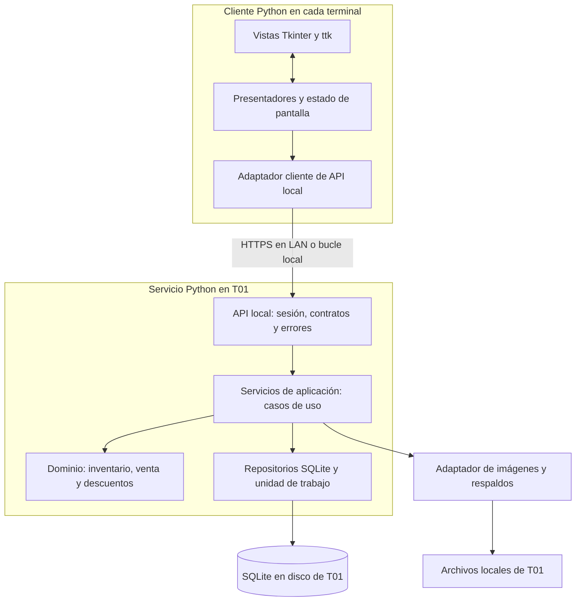
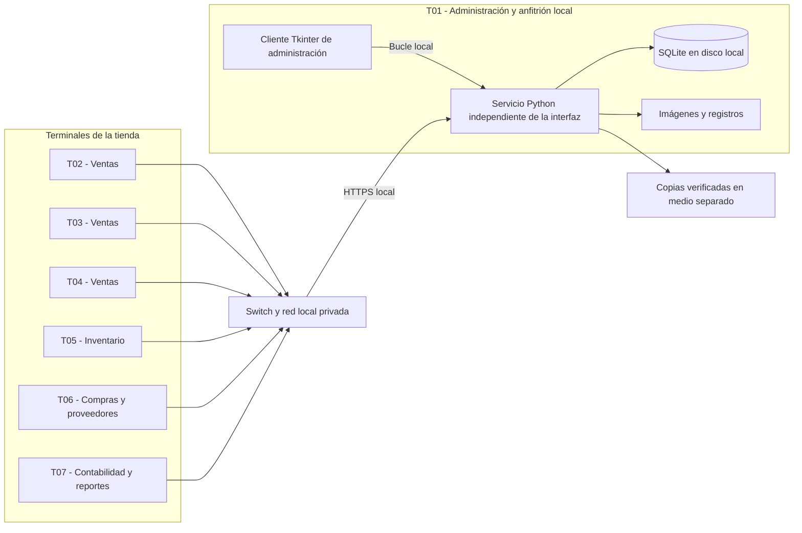

# Documento de Arquitectura de Software (SAD)

## Mis Trapitos — Sistema de escritorio para 7 terminales

| Control del documento | Valor |
| --- | --- |
| Versión del SAD | 1.0 |
| Fecha | 10 de septiembre de 2026 |
| Estado | Propuesta de arquitectura sustentada en el prototipo; pendiente de implementación y validación de la operación con 7 terminales |
| Línea base examinada | `mis_trapitos_app_v7.py`, versión de aplicación 7.0, commit `78d66de` |
| Audiencia | Arquitectura, desarrollo, pruebas, administración y soporte de Mis Trapitos |
| Propósito | Justificar Python, Tkinter y SQLite; definir capas, patrones, distribución y operación sin internet |

### Resumen de la decisión

Mis Trapitos conservará una interfaz de escritorio en **Python y Tkinter** en cada una de las **7 terminales**. Un **servicio de aplicación Python**, alojado inicialmente en la terminal T01, atenderá a todos los clientes por la red local y será el único componente que acceda a **SQLite**, almacenado en el disco local de T01. El cliente de T01 utilizará el mismo servicio mediante la dirección de bucle local.

Esta distribución mantiene un inventario común y evita instalar un servidor de base de datos independiente. **No requiere internet para las funciones internas, pero las terminales T02–T07 sí requieren conectividad LAN con T01.** No se abrirá el archivo SQLite desde carpetas compartidas ni se mantendrán siete bases de negocio independientes.

El prototipo actual ejecuta interfaz, reglas y acceso a datos dentro de un solo programa. El servicio LAN, la separación por módulos y los mecanismos de concurrencia descritos como objetivo todavía no existen en el código. Este documento establece el diseño y sus pruebas de aceptación; no certifica que el prototipo ya soporte siete usuarios concurrentes.

## 1. Alcance, requisitos y supuestos

### 1.1 Alcance funcional

Se incluyen productos y variantes por talla/color, existencias y movimientos, ventas y descuentos, promociones, clientes e historial, proveedores, empleados, devoluciones, cancelaciones y reportes con exportación CSV. Corresponden a los requisitos RF-01 a RF-26 y RNF-01 declarados en `TRACEABILITY` del prototipo.

Se incluyen también las responsabilidades arquitectónicas necesarias para compartir esos datos: autenticación local, autorización, comunicación LAN, transacciones, respaldo y recuperación. No se incorpora comercio electrónico, sincronización entre sucursales, facturación fiscal ni procesamiento bancario. Registrar un método de pago no significa autorizar una transacción con un banco.

### 1.2 Supuestos de diseño

| ID | Supuesto adoptado | Efecto sobre la arquitectura |
| --- | --- | --- |
| S-01 | Las 7 terminales pertenecen a una tienda y comparten catálogo e inventario. | Una base de datos de negocio y una autoridad de escritura. |
| S-02 | Hay una LAN privada operativa, preferentemente cableada, aun cuando falle la conexión a internet. | La comunicación interna usa direcciones locales y no depende de servicios externos. |
| S-03 | T01 puede permanecer encendida durante el horario de operación. | Aloja el servicio y la base; su indisponibilidad detiene las escrituras de las demás terminales. |
| S-04 | La carga inicial es de 7 sesiones con transacciones breves; todavía no se dispone de mediciones. | SQLite es una elección inicial condicionada a las pruebas de carga de la sección 10. |
| S-05 | Se toma Windows como plataforma inicial de despliegue. | Los instaladores deben incluir Python, Tcl/Tk y dependencias verificadas; otra plataforma requiere validación propia. |
| S-06 | No se solicita confirmar ventas desde terminales aisladas de la LAN. | Ante aislamiento se conserva el borrador y se suspende la confirmación; no se sincronizan ventas independientes. |
| S-07 | No se ha definido la función exacta de cada puesto. | La asignación funcional de la sección 6 es una propuesta; los permisos pertenecen al usuario, no al equipo. |

Si se requiere trabajar con las siete terminales completamente aisladas, deberá revisarse S-06 y diseñarse asignación de existencias, sincronización y resolución de conflictos. Ese comportamiento no se obtiene copiando el archivo SQLite.

### 1.3 Atributos de calidad prioritarios

1. **Integridad:** una venta y sus efectos sobre existencias se confirman o revierten juntos; no se vende dos veces la última unidad.
2. **Operación local:** autenticación, ventas, inventario y reportes siguen disponibles sin internet cuando T01 y la LAN están activos.
3. **Mantenibilidad:** las reglas comerciales pueden probarse sin abrir ventanas ni depender del transporte de red.
4. **Usabilidad:** las consultas y solicitudes de red no bloquean el ciclo de eventos de Tkinter.
5. **Recuperabilidad:** existen copias verificadas y un procedimiento de restauración de datos e imágenes.
6. **Trazabilidad:** las operaciones identifican usuario, terminal, fecha y resultado.

## 2. Arquitectura existente y brechas

La revisión fue estática. Las referencias siguientes corresponden al archivo `mis_trapitos_app_v7.py` de la línea base indicada; se dan símbolos y líneas iniciales para facilitar su localización.

| Elemento | Evidencia en el prototipo | Implicación |
| --- | --- | --- |
| Interfaz de escritorio | `App(tk.Tk)`, línea 703; `show_main`, línea 756. | Una clase construye las pestañas y coordina eventos. |
| SQLite local | `Database.__init__`, línea 121; `App.__init__`, línea 704. | Cada instancia abre `mis_trapitos.db`; la ruta de la base depende del directorio de ejecución. |
| Mezcla de responsabilidades | `Database` contiene SQL y reglas de ventas; `App.refresh_products`, línea 1007, consulta SQL directamente. | Hay separación parcial entre interfaz y datos, pero no capas independientes ni MVC completo. |
| Esquema relacional | `create_schema`, línea 149; claves foráneas activadas en línea 125. | Existen diez tablas y restricciones de precios, cantidades y existencias. |
| Venta transaccional | `register_sale`, línea 499. | Agrupa escrituras de cabecera, detalle, stock y movimiento con `with self.conn`; las lecturas previas no toman un bloqueo de escritura anticipado. |
| Otras modificaciones | `save_product`, línea 470; `return_item`, línea 540; `cancel_sale`, línea 558. | Producto y movimiento pueden confirmarse por separado; devoluciones y cancelaciones validan antes de la transacción de escritura. Deben unificarse los límites transaccionales. |
| Acceso de empleados | `hash_password`, línea 107; `authenticate`, línea 437; `show_main`, línea 756. | Hay login y un campo de rol; todas las pestañas se muestran y no existe autorización efectiva por operación. Se usan contraseñas de ejemplo y SHA-256 directo. |
| Archivos | `store_product_image`, línea 883; `export_inventory_csv`, línea 1043; `export_report_csv`, línea 1601. | Las imágenes son archivos locales y pueden guardarse con rutas absolutas; CSV no equivale a un respaldo completo. |
| Dependencia externa opcional | `show_customer_email`, línea 1272. | Puede generar/copiar texto localmente y abrir un cliente con `mailto:`; no implementa envío de correo. |
| Datos y prueba de demostración | `seed_examples`, línea 315; `run_basic_tests`, línea 1630. | Se cargan ejemplos al iniciar y la prueba de interfaz registra una venta real en la base abierta. No deben utilizarse como preparación o validación de producción. |

No se encontró servicio de red, identificación de terminal, actualización entre equipos, respaldo automatizado, control de solicitudes duplicadas ni coordinación de siete instancias. Tampoco existe un archivo de dependencias que fije el entorno; Pillow es una dependencia externa importada por la aplicación.

## 3. Decisiones tecnológicas

### ADR-01 — Python como lenguaje de aplicación

**Decisión:** conservar Python para clientes, reglas comerciales y servicio local.

**Justificación:** el código existente ya utiliza Python. Sus módulos `sqlite3`, `csv`, `datetime` y `tkinter` cubren buena parte del trabajo de una aplicación administrativa sin servicios de nube. Un lenguaje común permite reutilizar modelos y contratos, y extraer gradualmente las reglas actuales sin reescribir todo el producto. `sqlite3` permite trabajar con una base en disco sin un proceso de servidor de base de datos separado. [Documentación oficial de sqlite3](https://docs.python.org/3/library/sqlite3.html).

**Coste y condición:** se debe distribuir un entorno reproducible, incluyendo Tcl/Tk y Pillow, y validar cada versión de Python antes de actualizar. Las operaciones lentas se ejecutarán fuera del hilo de interfaz. La elección no constituye una garantía de rendimiento: se verificará con siete sesiones y datos representativos.

**Alternativa considerada:** reescribir con otra plataforma de escritorio agregaría coste de migración sin resolver por sí mismo la concurrencia del inventario. Se mantiene Python por continuidad tecnológica y alcance de la tienda.

### ADR-02 — Tkinter/ttk para presentación de escritorio

**Decisión:** mantener Tkinter y sus controles `ttk` en las siete terminales.

**Justificación:** el sistema está orientado a formularios, tablas, selección de archivos y captura de ventas. Tkinter es la interfaz de Python a Tcl/Tk y ofrece un entorno de GUI local apropiado para estos flujos. Su disponibilidad se verificará en el paquete instalado, ya que no debe darse por presente en cualquier distribución de Python. [Documentación oficial de Tkinter](https://docs.python.org/3/library/tkinter.html).

**Coste y condición:** cada terminal necesita instalar el cliente. Se conserva el hilo principal para los widgets y se emplean tareas de trabajo para red, imágenes y exportaciones extensas; los resultados se aplican mediante una cola y `after()`. El modelo de eventos de Tkinter requiere evitar trabajo prolongado en sus manejadores. [Modelo de hilos de Tkinter](https://docs.python.org/3/library/tkinter.html#threading-model).

**Alternativa considerada:** una interfaz web en LAN también podría funcionar sin internet, pero introduciría otra tecnología de presentación y una reescritura que el alcance actual no exige.

### ADR-03 — SQLite en disco local detrás de un servicio

**Decisión:** una base SQLite central, abierta exclusivamente por el servicio Python de T01. Las terminales envían operaciones de negocio por la LAN.

**Justificación:** SQLite proporciona persistencia relacional embebida y transacciones con poca administración. Su documentación contempla que un servidor de aplicación traduzca solicitudes remotas en accesos locales a SQLite. Por ello, siete clientes no equivalen a siete equipos abriendo el archivo. [Usos apropiados de SQLite](https://www.sqlite.org/whentouse.html), [SQLite sobre una red](https://www.sqlite.org/useovernet.html).

**Restricción:** no se permite alojar la base activa en SMB, NFS, NAS montado ni carpetas sincronizadas. La comunicación de red termina en el servicio; el archivo y sus auxiliares permanecen en un sistema de archivos local del mismo anfitrión. Los bloqueos de archivos de red pueden comprometer la fiabilidad y WAL requiere que los procesos que acceden a la base estén en el mismo host. [SQLite sobre una red](https://www.sqlite.org/useovernet.html), [WAL](https://www.sqlite.org/wal.html).

**Coste y condición:** SQLite admite un escritor a la vez. La propuesta usa escrituras breves y serializadas; las lecturas pueden coexistir mediante WAL. Se considerará PostgreSQL u otro motor cliente-servidor si la carga medida incumple los objetivos después de optimizar consultas, o si se requiere alta disponibilidad o más sedes. El número de terminales por sí solo no demuestra capacidad. [WAL](https://www.sqlite.org/wal.html).

### ADR-04 — Capas dentro de una aplicación modular y servicio LAN único

**Decisión:** separar presentación, aplicación, dominio y persistencia, manteniendo un único servicio de negocio desplegable.

**Justificación:** ventas, movimientos y existencias necesitan una transacción común. Una aplicación modular permite separar responsabilidades sin introducir comunicación distribuida entre esos módulos. El servicio comparte la misma política de inventario entre las siete terminales y concentra autorización y auditoría.

**Coste:** T01 constituye un punto único de fallo; debe contar con respaldo, arranque automático, suspensión deshabilitada durante la jornada y recuperación ensayada. No se afirma alta disponibilidad. Los mecanismos de recuperación se detallan en la sección 8.

### ADR-05 — Una autoridad de inventario, sin confirmación desconectada

**Decisión:** solo el servicio confirma cambios en el inventario compartido. Una terminal desconectada conserva borradores, pero no emite una venta confirmada.

**Justificación:** dos cajas aisladas podrían vender la misma unidad si aceptaran operaciones sobre copias independientes. La prioridad es la integridad del inventario. La caída del acceso a internet es distinta de la caída de la LAN y no afecta por sí misma a este diseño.

**Coste:** el aislamiento de una terminal o la caída de T01 suspende sus nuevas confirmaciones. No hay reconciliación automática de siete bases ni un modo de ventas autónomas pendiente de sincronizar.

## 4. Capas, componentes y patrones

### 4.1 Vista lógica objetivo

Las flechas muestran llamadas en ejecución. Las interfaces de repositorio pertenecen a la aplicación/dominio y sus implementaciones residen en infraestructura: el dominio no importa Tkinter, HTTP ni `sqlite3`.

| Capa | Responsabilidades y componentes propuestos | Límites |
| --- | --- | --- |
| Presentación | Vistas de login, productos, ventas, clientes, proveedores, empleados, promociones, devoluciones y reportes; presentadores; carrito y mensajes. | No contiene SQL ni decide el stock definitivo, permisos o total autorizado. |
| Aplicación | `VentaService`, `InventarioService`, `CatalogoService`, `ClienteService`, `UsuarioService`, `ReporteService`; coordinación, sesión y transacciones. | No construye widgets ni expone operaciones SQL arbitrarias al cliente. |
| Dominio | Producto/variante, venta/detalle, promoción y movimiento; reglas de cantidades, descuentos, devoluciones y cancelaciones. | Se prueba sin ventanas, sockets ni archivos de base. |
| Infraestructura | Repositorios SQLite, unidad de trabajo, API LAN, cliente de API, imágenes, reloj, registros y respaldo. | Implementa los contratos de acceso; no duplica reglas comerciales. |

La organización prevista es `ui/`, `application/`, `domain/`, `infrastructure/` y `tests/`, con puntos de entrada independientes para cliente y servicio. Estos nombres son una propuesta de módulos, no archivos ya implementados.

### 4.2 Patrones de diseño adoptados

| Patrón | Aplicación concreta | Beneficio y estado |
| --- | --- | --- |
| Arquitectura en capas | Separar ventanas, casos de uso, reglas e infraestructura. | Permite modificar almacenamiento o presentación sin reescribir reglas. Propuesto; actualmente hay acoplamiento. |
| MVP (Modelo–Vista–Presentador) | Un presentador por flujo coordina eventos de Tkinter y llamadas al servicio; la vista muestra el resultado. | Permite probar interacción y estados sin depender de widgets. Propuesto; `App` concentra hoy estas tareas. |
| Capa de servicios | Una operación `registrar_venta` orquesta autorización, reglas, repositorios y confirmación. | Las siete terminales ejecutan las mismas reglas. Propuesto como extracción de métodos de `Database`. |
| Repository | Repositorios de productos, ventas, clientes y movimientos exponen métodos de negocio. | Encapsula consultas parametrizadas y facilita sustituir SQLite si fuera necesario. Propuesto. |
| Unit of Work (unidad de trabajo) | Una conexión y transacción por caso de uso de escritura; un único `commit` final. | Mantiene atómicos venta, detalle, stock, auditoría e idempotencia. Hay una aproximación parcial en `register_sale`. |
| Adapter e inyección de dependencias | Adaptadores de API, persistencia, archivos y reloj inyectados al construir servicios/presentadores. | Permite pruebas con dobles y acceso local/remoto mediante contratos claros. Propuesto. |

No se requiere Singleton para la conexión ni compartir un objeto `sqlite3.Connection` entre hilos de clientes. La instancia de servicio y las conexiones se administran en el arranque de infraestructura.

## 5. Datos y reglas de integridad

### 5.1 Modelo de información existente

| Entidad / tabla | Responsabilidad y relaciones |
| --- | --- |
| `products` | Cada registro identifica una variante por código, talla y color; almacena stock, precios y un proveedor opcional. |
| `suppliers` | Contacto del proveedor; relación uno a muchos con productos. No hay relación muchos a muchos de suministro en v7. |
| `customers` | Datos de contacto y región; un cliente puede asociarse con varias ventas y una venta puede carecer de cliente. |
| `employees` | Cuenta y rol; cada venta identifica un empleado. |
| `promotions` | Porcentaje e intervalo de vigencia asociados a un producto. |
| `sales` / `sale_items` | Cabecera y renglones de la venta; relación uno a muchos. Cada renglón referencia un producto. |
| `inventory_movements` | Entradas, salidas, ajustes, devoluciones y cancelaciones; referencia al producto y, cuando aplica, a la venta. |
| `returns` / `cancellations` | Registro de devoluciones por venta/producto y de cancelación de ventas. |

Se conservarán claves primarias, referencias, SQL parametrizado y restricciones de cantidades. `foreign_keys=ON` se establecerá en **cada conexión**. Se añadirán índices según consultas medidas, inicialmente sobre fecha/estado de ventas, claves de detalle, movimientos por producto/fecha y promociones por producto/vigencia.

### 5.2 Reglas de negocio que debe conservar la extracción

- Una cantidad de venta es un entero positivo y el stock final nunca es negativo.
- Para promociones superpuestas de un producto se toma el porcentaje máximo vigente, como hace `active_promotion_percent`; después se aplica el descuento general de venta al subtotal ya promocionado.
- Precio, promoción y total se calculan de nuevo en el servicio al confirmar. El carrito no reserva unidades. Si las condiciones cambiaron respecto de lo mostrado, el usuario debe aceptar el nuevo importe antes de confirmar.
- La devolución acumulada no puede exceder lo vendido y no procede sobre una venta cancelada. Una cancelación repone únicamente unidades que aún no fueron devueltas.
- Alta o ajuste de existencias y su movimiento deben ser atómicos. Para ediciones concurrentes se usará una versión esperada del producto y se rechazará una edición desactualizada; no se sobrescribirá stock desde un formulario antiguo.
- Las líneas repetidas de un mismo producto se consolidarán antes de validar ventas y devoluciones.

### 5.3 Cambios de persistencia propuestos

Se agregará identidad de terminal y usuario a los eventos operativos, un registro de auditoría, control de versión del esquema y una tabla de solicitudes para idempotencia. Esta última tendrá una clave única de solicitud, terminal, usuario, huella del contenido y resultado confirmado. Una solicitud repetida con el mismo contenido devuelve el resultado original; una clave reutilizada con contenido diferente se rechaza.

Los importes existentes usan `REAL` y `float`. El diseño objetivo persistirá centavos como enteros y calculará descuentos con `Decimal`, con redondeo a centavos explícito y uniforme en cada renglón y descuento general. La migración conservará los importes históricos mediante conversión verificada; no recalculará ventas cerradas con precios actuales. Se guardará el costo unitario al vender para que los reportes de utilidad no dependan de cambios posteriores en el costo del producto.

El servicio será la autoridad temporal. Se definirán fecha de negocio y zona horaria de la tienda en su configuración; los reportes y promociones usarán ese mismo criterio. La v7 mezcla fechas calculadas por Python y por SQL, por lo que esta normalización requiere revisión y pruebas de límites de día y mes.

Las imágenes originales residirán en T01 y se identificarán por rutas relativas o identificadores de archivo. Los clientes recibirán su contenido por la API y podrán conservar miniaturas reemplazables. No se transmitirán rutas absolutas del disco de una terminal como referencia válida para las otras.

## 6. Distribución física de las 7 terminales

### 6.1 Despliegue propuesto sin equipo adicional

| Terminal | Uso inicial propuesto | Componentes instalados | Datos y acceso |
| --- | --- | --- | --- |
| T01 | Administración general; anfitrión del sistema | Cliente Python/Tkinter; servicio Python; SQLite; imágenes; respaldo y registro. | Única base de negocio en disco local. El cliente usa el servicio mediante bucle local. |
| T02 | Caja / ventas 1 | Cliente Python/Tkinter y adaptador de API. | Acceso al servicio por LAN; borrador y caché local no autoritativa. |
| T03 | Caja / ventas 2 | Cliente Python/Tkinter y adaptador de API. | Mismas reglas y base compartida mediante el servicio. |
| T04 | Caja / ventas 3 | Cliente Python/Tkinter y adaptador de API. | Mismas reglas y base compartida mediante el servicio. |
| T05 | Inventario y recepción de mercancía | Cliente Python/Tkinter y adaptador de API. | Entradas y ajustes centralizados con control de versión. |
| T06 | Compras, productos y proveedores | Cliente Python/Tkinter y adaptador de API. | Mantenimiento de catálogo y proveedores según permisos. |
| T07 | Contabilidad, consulta y reportes | Cliente Python/Tkinter y adaptador de API. | Consultas centralizadas y exportación autorizada de resultados. |

**Conteo:** siete equipos físicos, siete clientes de escritorio, un servicio de aplicación y una base SQLite autoritativa. La distribución de puestos es ilustrativa: un empleado autorizado puede cambiar de terminal sin cambiar sus permisos.

T01 se elige para evitar suponer un octavo equipo no solicitado. El servicio debe iniciar con Windows y seguir activo aunque se cierre la ventana administrativa o su sesión interactiva. Si la medición o disponibilidad exige un equipo dedicado, se moverán servicio y datos a ese anfitrión y se actualizará la dirección de los clientes; ello agregaría un octavo equipo de infraestructura, manteniendo siete terminales de usuario.

### 6.2 Red, configuración y archivos

- T01 tendrá dirección reservada o nombre resuelto localmente; no se utilizará DNS público para localizarlo. El puerto de servicio será configurable y se abrirá solo para la LAN autorizada.
- Se usará HTTPS con confianza local distribuida durante la instalación y sin desactivar la verificación de certificados. El protocolo será JSON con contratos versionados. El certificado y la configuración necesarios deben estar disponibles sin internet.
- Cada cliente guardará `terminal_id`, dirección del servicio, confianza TLS y versión de contrato. La sesión determinará el usuario; el servicio no confiará en un `employee_id` arbitrario enviado por la interfaz.
- Base, archivos WAL y auxiliares se ubicarán en una carpeta de datos del disco local de T01, fuera del repositorio y de carpetas sincronizadas; por ejemplo, `%ProgramData%\MisTrapitos\data`. Imágenes y registros irán en subcarpetas administradas con permisos de la cuenta del servicio.
- El servicio es un componente de aplicación que debe implementarse y empaquetarse. Este SAD define su responsabilidad y protocolo, sin afirmar que la v7 incluya un servidor HTTP ni seleccionar un framework aún no evaluado.

## 7. Ejecución, concurrencia y confirmación de ventas

### 7.1 Contrato y flujo de una venta

El cliente enviará identificador único de solicitud, identidad de terminal, productos/cantidades, cliente opcional, método de pago, descuento solicitado y condiciones mostradas para confirmar. La identidad de empleado se obtendrá de la sesión autenticada. La respuesta incluirá resultado, identificador de venta, importes definitivos y stock actualizado de los productos afectados; los errores serán de negocio, autorización, indisponibilidad o contrato incompatible.

1. El presentador verifica formato, conserva un borrador e identificador de solicitud y envía la operación sin bloquear Tkinter.
2. La API autentica la sesión, comprueba permisos y valida el contrato. El servicio envía el comando a una cola acotada de escritura.
3. El trabajador de escritura inicia una transacción explícita con `BEGIN IMMEDIATE`, consulta la clave de idempotencia y relee los productos. Consolida cantidades y valida stock, descuentos, vigencia y condiciones aceptadas.
4. Inserta cabecera y detalles; descuenta stock con una actualización condicionada a `stock >= cantidad` y comprueba las filas afectadas. Registra movimientos, auditoría y resultado de la solicitud dentro de la misma transacción.
5. Ejecuta `COMMIT` y solo después devuelve la venta confirmada. Cualquier fallo previo provoca `ROLLBACK` completo. No se realizan llamadas de red, diálogos ni manejo de imágenes mientras se mantiene la transacción.
6. El cliente muestra el comprobante con los valores devueltos y actualiza su inventario. Las otras terminales refrescan las vistas activas al consultarlas y mediante sondeo periódico.

`BEGIN IMMEDIATE` obtiene desde el inicio una transacción de escritura y puede devolver `SQLITE_BUSY` si ya hay un escritor; por ello requiere tratamiento explícito. [Transacciones SQLite](https://www.sqlite.org/lang_transaction.html).

### 7.2 Política de acceso a SQLite

El servicio tendrá un único trabajador de escritura con conexión creada y utilizada en ese hilo. Las consultas usarán conexiones de lectura propias, también abiertas en T01, con resultados acotados/paginados. Ninguna conexión se compartirá libremente entre hilos. La unidad de trabajo será responsable del inicio y fin de transacción; los repositorios no harán `commit` por su cuenta.

Se configurará WAL, `foreign_keys=ON`, espera de bloqueo limitada y una política de durabilidad explícita (`synchronous=FULL` como punto inicial). Se comprobarán los valores efectivos al arrancar. La implementación fijará el modo transaccional de `sqlite3` para evitar depender de sus valores predeterminados entre versiones. WAL permite lectores concurrentes con un escritor, pero no varios escritores simultáneos. [WAL](https://www.sqlite.org/wal.html), [Control transaccional en Python](https://docs.python.org/3/library/sqlite3.html#transaction-control), [PRAGMA synchronous](https://www.sqlite.org/pragma.html#pragma_synchronous).

La cola y los tiempos de espera serán acotados y configurables; al agotarse se devolverá un error recuperable. Se registrarán tiempo de espera, duración de transacción y fallos `SQLITE_BUSY` para ajustar capacidad. Los checkpoints de WAL se supervisarán y los reportes extensos no mantendrán lecturas abiertas innecesariamente. Los tiempos concretos se ajustarán en el ensayo de carga.

Las devoluciones, cancelaciones y ajustes usarán el mismo trabajador y validarán dentro de su transacción, para impedir dobles reposiciones o escrituras basadas en datos vencidos.

### 7.3 Duplicados, pérdida de respuesta y actualización visual

La pérdida de respuesta no significa que la venta haya fallado. El cliente marcará la operación como **pendiente de comprobar**, conservará su identificador incluso después de reiniciarse y consultará su resultado al recuperar conexión. Podrá reenviar el mismo contenido con la misma clave; el servicio devolverá la venta ya confirmada sin duplicarla. No se generará una nueva clave ni se iniciará otro cobro para esa misma operación mientras su resultado siga incierto.

Este registro local es una ayuda para recuperar una solicitud, no una segunda base de ventas ni autorización para aceptar nuevas ventas desconectadas. Si se modifica un borrador después de un rechazo definitivo, se crea una nueva solicitud.

Después de restaurar un respaldo se aplica una excepción: una clave ausente puede pertenecer a una venta confirmada después del punto recuperado. El servicio publicará un nuevo identificador de recuperación y bloqueará el reenvío automático de solicitudes de la generación anterior hasta conciliarlas. No se interpretará su ausencia como prueba de que la venta nunca existió.

Para RNF-01, el stock cambia atómicamente al confirmar la venta y la terminal vendedora recibe el nuevo valor en la respuesta. Para las otras terminales se propone una visibilidad máxima de **5 segundos**, con LAN sana y dentro de la carga validada. Este umbral interpreta la actualización visual entre puestos; es un objetivo por verificar y no una garantía literal de simultaneidad. La confirmación siempre relee el stock real, aunque la tabla visible todavía esté desactualizada.

## 8. Operación sin internet, instalación y recuperación

### 8.1 Comportamiento por escenario

| Escenario | Comportamiento esperado |
| --- | --- |
| Internet disponible o desconectado; LAN y T01 operativos | Login local, catálogo, ventas, movimientos, clientes, promociones y reportes funcionan en las siete terminales. No hay autenticación en nube ni descargas durante el arranque. |
| Sin internet y se solicita correo | Se puede generar y copiar el texto. El envío depende del cliente de correo y de su conectividad; no bloquea la venta. |
| Pago con tarjeta o transferencia | El sistema registra el método. La autorización/verificación bancaria es un proceso externo cuya disponibilidad no garantiza este SAD. |
| T02–T07 pierden conexión con T01 | Se señala desconexión, se conserva el borrador y se bloquean confirmaciones y modificaciones. Una consulta en caché se muestra como desactualizada y no certifica existencias. |
| Se interrumpe la LAN, pero T01 funciona | El cliente de T01 puede operar por bucle local; los demás esperan la recuperación de red. |
| Servicio T01 detenido | Ninguna terminal confirma cambios, incluido su cliente local. Se intenta reinicio controlado y se revisa la salud del servicio. |
| T01 apagada o con fallo de disco | Se aplica recuperación desde respaldo; no se activa otra base en paralelo. |
| Se perdió una respuesta durante una venta | Se consulta la clave de solicitud y se resuelve el resultado antes de repetir la operación como nueva. |

### 8.2 Instalación y actualización sin conexión

El paquete de instalación deberá contener aplicación, versión validada de Python, Tcl/Tk, Pillow, dependencias del servicio, certificados locales y recursos de interfaz. Las dependencias y sus versiones quedarán fijadas en un manifiesto reproducible. La instalación en un equipo limpio y sin internet formará parte de la aceptación.

Se separarán código, configuración y datos. La inicialización de producción creará el esquema y permitirá establecer credenciales propias; no ejecutará `seed_examples`. La versión del cliente, API y esquema se verificará al conectar. Un cliente incompatible recibirá un aviso de actualización antes de modificar datos.

Las actualizaciones se distribuirán por medio local o LAN durante una ventana acordada. Antes de migrar se generará una copia verificada; se suspenderán nuevas escrituras, se aplicará la migración versionada y se comprobarán salud e integridad. Un retorno a una versión anterior requerirá un esquema compatible o restaurar su copia correspondiente; no se reemplazará únicamente el ejecutable si la base ya no es compatible.

### 8.3 Respaldo y restauración

**Objetivos iniciales propuestos:** RPO de 1 hora (pérdida máxima de datos ante pérdida completa del equipo, condicionada al último respaldo exitoso) y RTO de 60 minutos (tiempo para recuperar el servicio). Se medirán; no son prestaciones demostradas del prototipo.

El responsable será administración o soporte designado. Se programará respaldo de base cada hora y al cierre, con conservación inicial de 24 copias horarias, 14 diarias y 4 semanales, sujeta al espacio medido. Una copia deberá quedar en un medio distinto del disco de T01; si ese medio está fuera de línea, el RPO ante pérdida de T01 se calcula desde la última copia que efectivamente llegó a él. El sistema registrará y mostrará respaldos fallidos o vencidos.

Se utilizará `sqlite3.Connection.backup()` para obtener una instantánea consistente con la base abierta. No se copiará solo el archivo `.db` mientras esté en uso, especialmente con WAL. Se incluirán imágenes, configuración necesaria y manifiesto de versiones/fecha/comprobaciones. Para mantener coherencia con las imágenes se usarán archivos inmutables y se suspenderán brevemente sus altas/bajas durante la captura de la instantánea y del listado que se copiará. Los archivos incluidos en ese manifiesto quedarán protegidos frente a eliminación hasta terminar y verificar la copia completa. [API de respaldo de Python](https://docs.python.org/3/library/sqlite3.html#sqlite3.Connection.backup), [Respaldo de SQLite](https://www.sqlite.org/backup.html).

La restauración deberá seguir este orden:

1. Detener el servicio y aislar el anfitrión anterior si se utilizará un equipo sustituto, para evitar dos autoridades de escritura.
2. Elegir una copia completa, verificar su manifiesto y restaurar base, imágenes y configuración en disco local con los permisos correctos.
3. Ejecutar `PRAGMA integrity_check` y `PRAGMA foreign_key_check`; verificar versión de esquema, archivos referenciados y cifras de control del respaldo.
4. Iniciar el servicio en modo de recuperación con un nuevo identificador de generación y nuevas escrituras suspendidas; validar login y lectura. Realizar una prueba transaccional controlada en una copia de validación y comprobar el tratamiento de solicitudes inciertas.
5. Restablecer la dirección del servicio para los clientes, registrar el punto temporal recuperado y conciliar las operaciones posteriores al respaldo con los comprobantes disponibles. Solo después se habilitarán nuevas escrituras y los reenvíos autorizados de solicitudes anteriores; una clave ausente no habilita por sí sola su repetición.

El responsable realizará un ensayo de recuperación mensual. UPS para T01 y el equipo de red reduce interrupciones por energía, pero no sustituye copias verificadas ni proporciona alta disponibilidad.

## 9. Seguridad y observabilidad

Las decisiones siguientes responden a brechas observadas en el login, los roles y el acceso local de la v7; son trabajo pendiente para el despliegue compartido.

| Área | Decisión objetivo |
| --- | --- |
| Identidad | Cuentas propias por empleado; eliminar credenciales predeterminadas de producción y usar una función de derivación de contraseñas con sal individual y coste configurable mediante una biblioteca mantenida. |
| Autorización | El servicio verifica cada operación. Propuesta: Ventas registra ventas y clientes; Inventario administra entradas/ajustes; Compras mantiene proveedores/catálogo; Contabilidad consulta/exporta reportes; Propietario administra usuarios y autoriza operaciones sensibles. Los descuentos excepcionales, cancelaciones y devoluciones requieren el permiso correspondiente. |
| Sesión | Sesiones locales con expiración y cierre explícito; el token no se registra en archivos de diagnóstico. Los permisos se verifican en el servicio aunque la interfaz oculte botones. |
| Archivos y red | Cuenta de servicio con acceso a datos; clientes sin acceso directo al `.db`. Cifrado TLS en LAN y acceso restringido al puerto local. Copias y exportaciones solo para usuarios autorizados. |
| Auditoría | Usuario, terminal, solicitud, fecha del servicio, operación, entidad afectada y resultado; los cambios confirmados se auditan en su misma transacción. No se registran contraseñas ni datos bancarios. |
| Diagnóstico | Registro rotativo de arranque, versión, migraciones, errores, esperas, disco disponible y respaldos. Un endpoint de salud informa disponibilidad y compatibilidad sin exponer datos de clientes. |

El identificador de terminal ayuda a la trazabilidad y no reemplaza autenticación. Los reportes y las imágenes se entregan según la misma sesión autorizada. No se almacenan números completos de tarjeta ni credenciales bancarias; el modelo actual solo registra el método de pago.

## 10. Verificación y trazabilidad de aceptación

### 10.1 Correspondencia con la historia de usuario

| Necesidad / criterio | Evidencia documental |
| --- | --- |
| Elaborar el SAD del sistema | Línea base, alcance y distinción entre prototipo y objetivo en secciones 1–2. |
| Justificar Python, Tkinter y SQLite en escritorio | Decisiones ADR-01, ADR-02 y ADR-03, alternativas y consecuencias en sección 3. |
| Detallar patrones de diseño y separación de capas | Vista lógica, responsabilidades y patrones en sección 4. |
| Justificar distribución para las 7 terminales | Topología, tabla T01–T07, conteo de componentes y decisión de anfitrión en sección 6. |
| Explicar operación sin internet | Supuestos de LAN, decisión ADR-05 y matriz de fallos en sección 8. |
| Mantener coherencia del inventario (RF-03–RF-06, RNF-01) | Reglas, transacción única, serialización, idempotencia y actualización visual en secciones 5 y 7. |
| Cubrir descuentos, entidades y reportes (RF-01–RF-02, RF-07–RF-26) | Alcance, componentes y modelo de datos en secciones 1, 4 y 5. La corrección de cada reporte necesita sus pruebas funcionales. |

El criterio documental queda cubierto por estas secciones. La aceptación de la **implementación** multiusuario exige las pruebas siguientes y no se deduce de la mera existencia del SAD.

### 10.2 Escenarios de validación del diseño objetivo

Todos se ejecutarán con datos de prueba en un entorno aislado. No se utilizará el botón `run_basic_tests` contra datos operativos.

| ID | Dado / cuando | Resultado verificable |
| --- | --- | --- |
| PA-01 | Instalación limpia de los paquetes y arranque de las 7 terminales sin acceso a internet, con LAN activa. | Inician, autentican localmente y completan ventas, inventario, consultas y exportación sin descargar recursos. |
| PA-02 | Siete sesiones solicitan simultáneamente la última unidad del mismo producto, con permisos de venta para la prueba. | Una venta se confirma; las otras reciben falta de stock. Stock final cero; una salida y un detalle válidos, sin efectos parciales. |
| PA-03 | Se inyecta un fallo entre la inserción del detalle y la actualización del inventario. | Se revierte todo el caso de uso: no quedan cabecera, detalle, stock, movimiento o resultado de solicitud parcialmente confirmados. |
| PA-04 | Se corta la respuesta después de `COMMIT` y se reinicia el cliente antes de reenviar la misma clave. | Se recupera la venta original; no hay otro cargo registrado ni otra salida de inventario. |
| PA-05 | Dos sesiones intentan devolver o cancelar simultáneamente la misma venta. | El total repuesto no supera la cantidad vendida pendiente de devolución; la cancelación ocurre una sola vez. |
| PA-06 | Una terminal pierde la LAN y luego la recupera. | Identifica desconexión, bloquea confirmaciones, conserva borrador y reconcilia solicitudes inciertas antes de continuar. |
| PA-07 | Se cierra el cliente administrativo de T01 con el servicio activo. | Las otras seis terminales siguen operando. Al detener el servicio, las siete muestran indisponibilidad. |
| PA-08 | Una venta se confirma mientras otras terminales visualizan existencias. | Stock actualizado en la respuesta de venta y visible en las demás en un máximo propuesto de 5 segundos con red sana. |
| PA-09 | Se restaura una copia completa en un anfitrión de prueba, incluyendo una solicitud confirmada después del respaldo cuya clave ya no está presente. | Integridad y claves foráneas correctas, imágenes disponibles, un único servicio activo y RPO/RTO medidos contra los objetivos de la sección 8. El cliente detecta la recuperación y no reenvía automáticamente la solicitud ausente sin conciliación. |
| PA-10 | Un usuario sin permiso invoca directamente una operación administrativa de la API. | El servicio rechaza la operación, aunque se eviten los controles de interfaz, y no modifica datos. |
| PA-11 | Siete sesiones operan durante 30 minutos sobre 10 000 variantes, 100 000 ventas y 300 000 detalles de prueba; cada sesión alterna una consulta y una escritura cada 10 segundos, con ráfagas simultáneas y un reporte concurrente. | Objetivos iniciales: percentil 95 de consultas comunes y confirmaciones ≤ 2 segundos, reportes habituales ≤ 10 segundos, sin bloqueos visibles de la UI ni pérdida de integridad. Registrar hardware, tamaños, latencias y errores; ajustar SQLite o arquitectura si no se cumplen. |
| PA-12 | Se cambia promoción, precio o stock mientras un carrito está abierto y se envía una edición antigua de producto. | La venta revalida sus condiciones, pide aceptar un importe cambiado y rechaza stock insuficiente; la edición antigua no sobrescribe existencias nuevas. |

Los volúmenes, tiempos y políticas de recuperación son supuestos medibles de diseño, no valores proporcionados por el negocio ni resultados obtenidos. Una sola prueba local o la ausencia de errores al iniciar no demuestra capacidad para siete terminales.

## 11. Evolución desde la v7 y riesgos pendientes

### 11.1 Secuencia de implementación

1. **Preparar la línea base:** fijar dependencias, separar datos de código, desactivar ejemplos en producción y crear fixtures de prueba que no alteren datos reales.
2. **Extraer las capas:** mover reglas de `Database` a servicios/dominio, SQL a repositorios y coordinación de `App` a presentadores. Mantener resultados comerciales existentes mediante pruebas de caracterización.
3. **Fortalecer integridad:** unidad de trabajo para toda modificación, transacciones explícitas, cantidades consolidadas, dinero, reloj común y migraciones verificadas.
4. **Incorporar el servicio:** API LAN, trabajador de escritura, lectura controlada, sesiones, permisos, terminales, idempotencia y tratamiento de fallos en el cliente.
5. **Preparar operación:** instaladores sin conexión, servicio de arranque automático, certificados, copias, registros y procedimiento de restauración.
6. **Desplegar progresivamente:** validar T01, incorporar una terminal remota y después las siete; ejecutar PA-01 a PA-12 antes de declarar listo el despliegue compartido.

### 11.2 Riesgos y decisiones que deben revisarse

| Riesgo / dato pendiente | Tratamiento y condición de revisión |
| --- | --- |
| Fallo de T01 o del switch | Copias, recuperación ensayada y energía protegida. Si la tienda requiere continuidad automática, diseñar otra solución de disponibilidad. |
| Contención de SQLite o consultas pesadas | Medir PA-11, optimizar índices/paginación y tiempos de transacción. Migrar a motor cliente-servidor si los objetivos siguen incumplidos. |
| Topología o funciones de los 7 puestos distintas a S-01/S-07 | Revisar la asignación de terminales; si hay varias sedes o red intermitente, revisar la autoridad del inventario. |
| Política comercial de devoluciones, descuentos y reportes | Validar con el responsable del negocio los permisos, redondeos y criterios de utilidad; documentar cualquier cambio frente a v7. |
| Paquete de servicio y contrato aún sin implementar | Seleccionar y fijar dependencias tras verificar soporte de TLS, arranque local y despliegue sin internet. |
| Pérdida de transacciones posteriores al respaldo | Reconocer el RPO real, registrar el punto recuperado y conciliar comprobantes antes de reanudar. Un respaldo no proporciona pérdida cero. |

## 12. Fuentes y método de elaboración

**Fuente del sistema:** revisión estática de `mis_trapitos_app_v7.py` (v7.0, commit `78d66de`), en particular `TRACEABILITY`, `Database`, `App` y los métodos citados en la sección 2. No se ejecutó la aplicación ni su carga automática de ejemplos para elaborar este SAD.

**Fuentes técnicas primarias:** documentación oficial de [Python sqlite3](https://docs.python.org/3/library/sqlite3.html), [Tkinter](https://docs.python.org/3/library/tkinter.html), [usos apropiados de SQLite](https://www.sqlite.org/whentouse.html), [SQLite sobre una red](https://www.sqlite.org/useovernet.html), [WAL](https://www.sqlite.org/wal.html), [transacciones SQLite](https://www.sqlite.org/lang_transaction.html) y [respaldo SQLite](https://www.sqlite.org/backup.html). Los enlaces se incluyen junto a las decisiones que sustentan.

Las decisiones de distribución T01–T07, los patrones objetivo, los umbrales de calidad y las políticas operativas son propuestas derivadas del alcance y del código revisado. No se presentan como requisitos previamente aprobados ni como funcionalidades ya implementadas.
