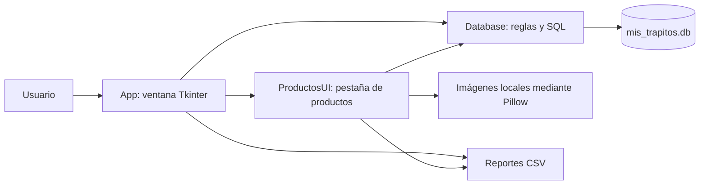
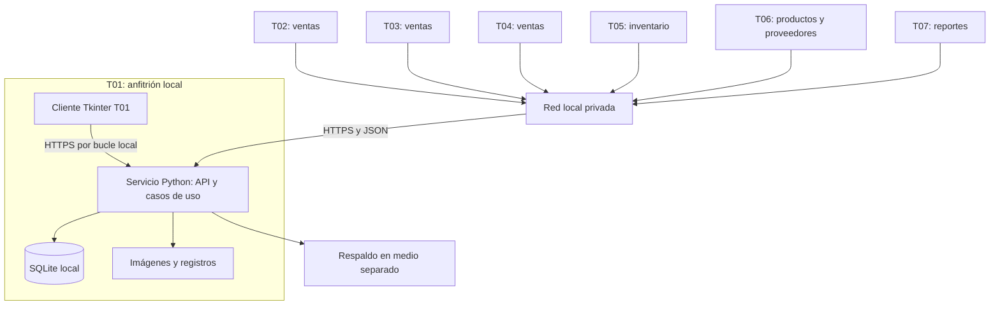
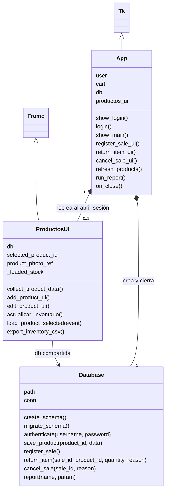
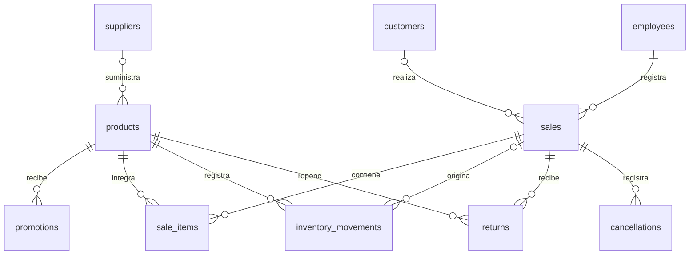
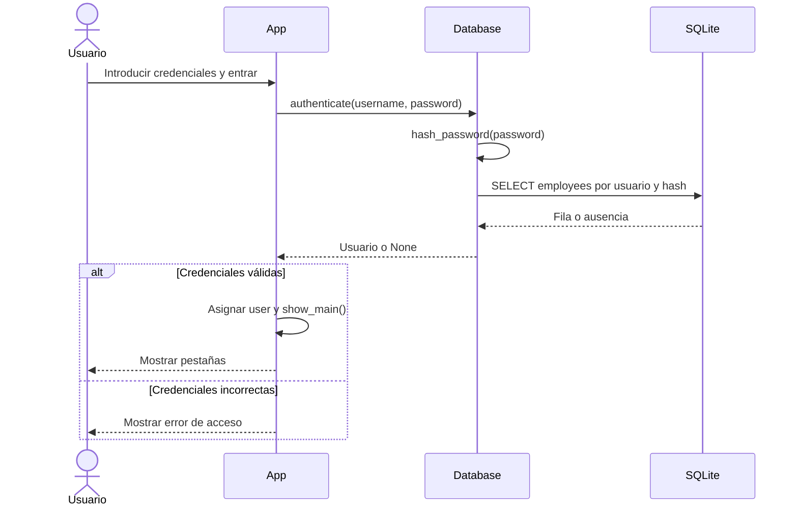
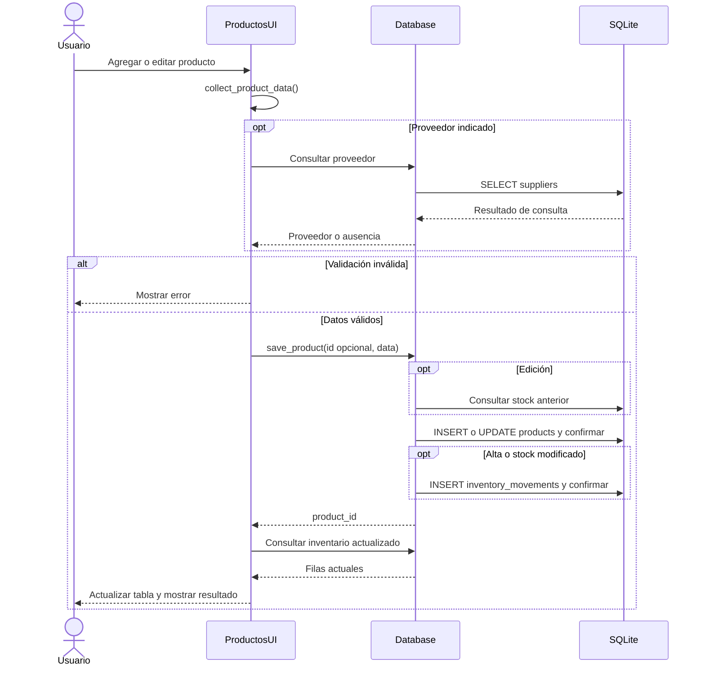
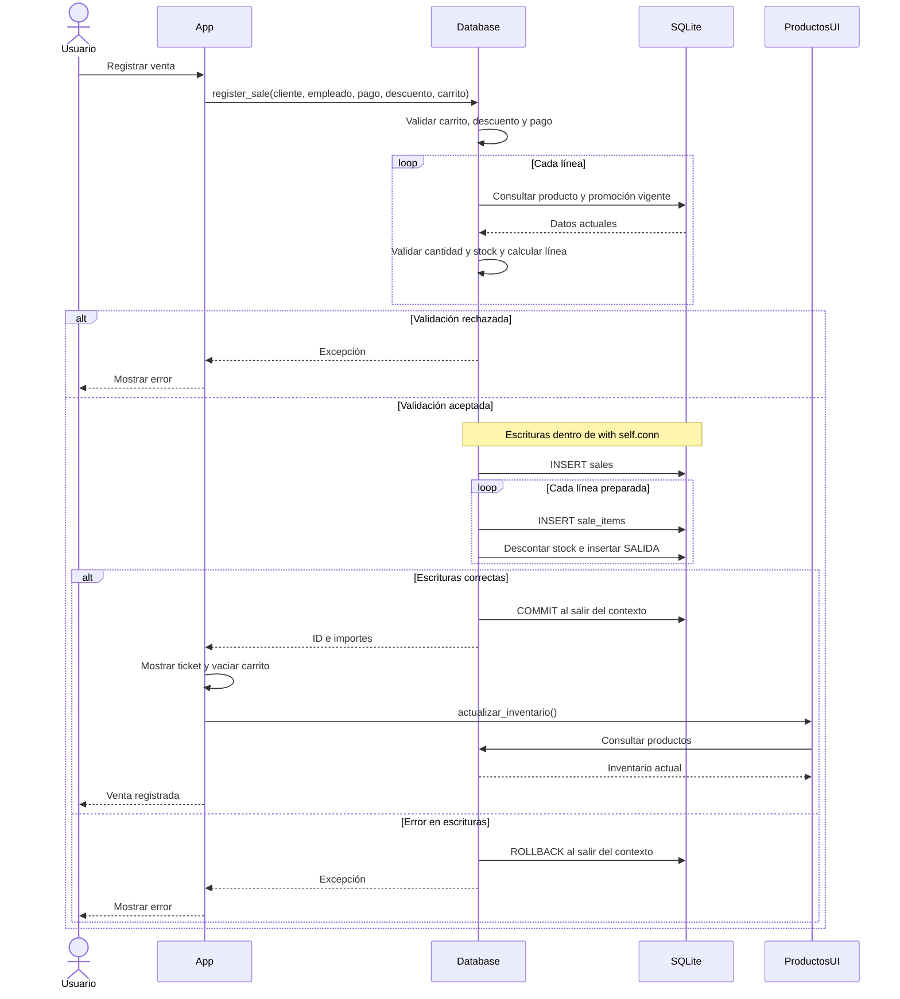
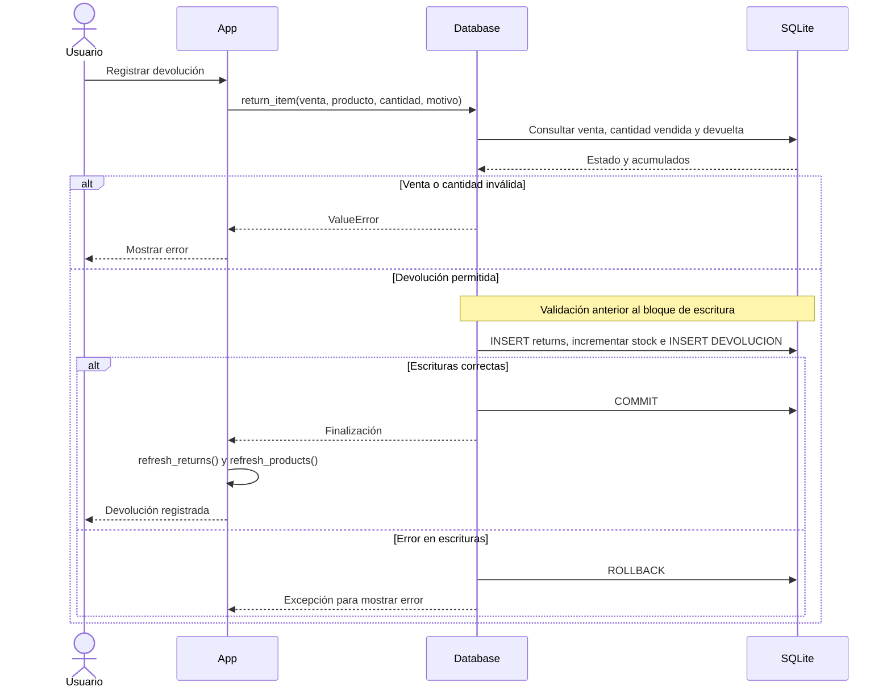
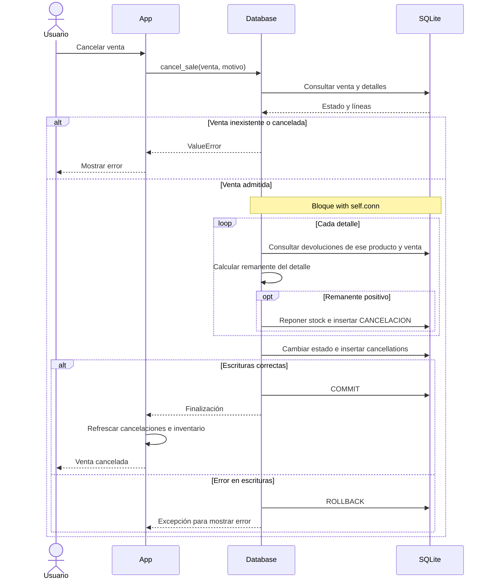
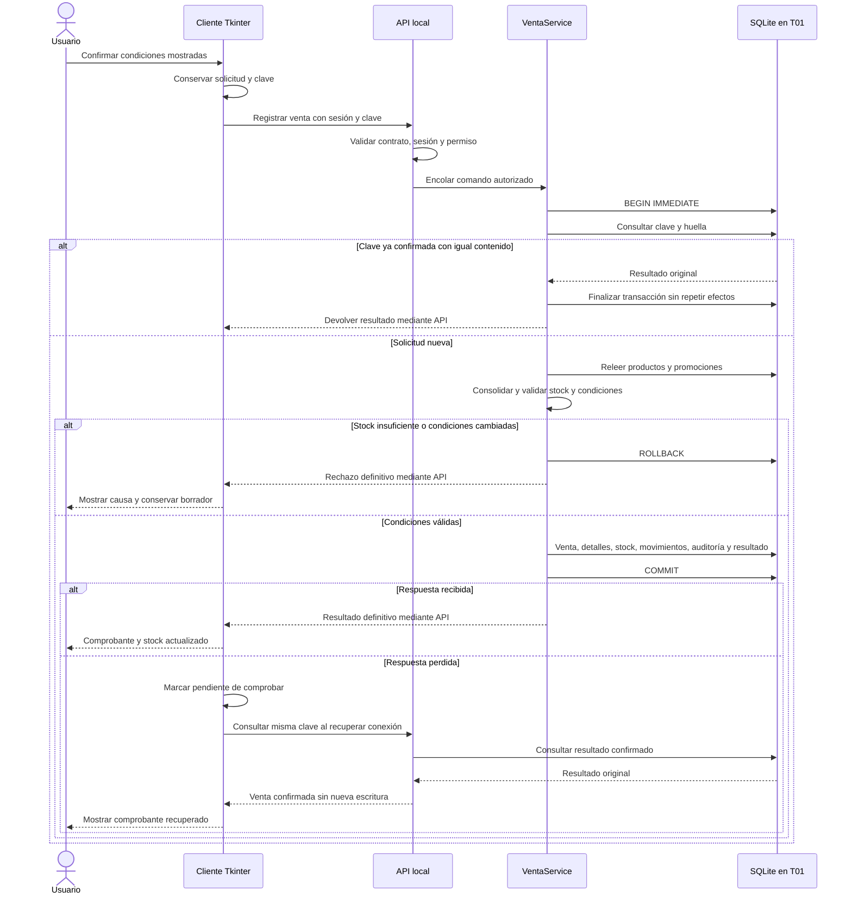

# Documento de Diseño de Software (SDD)

## Mis Trapitos — Sistema de gestión de tienda de ropa

| Control documental | Valor |
| --- | --- |
| Identificador | MT-SDD-001 |
| Versión | 1.0 |
| Fecha de elaboración | 10 de septiembre de 2026 |
| Estado | Elaborado para revisión del equipo; validación documental registrada en la sección 10 |
| Historia de usuario | [#5 — Software Design Document](https://github.com/SQEquipo3/Trapitos/issues/5) |
| Épica | [#3 — Creación y/o actualización de documentación del sistema](https://github.com/SQEquipo3/Trapitos/issues/3) |
| Sistema de referencia | Mis Trapitos, versión de aplicación 7.0 |
| Línea base de código | Commit `bbe7fc1cf91eea5f3e9c80e22d80ca9688811c35` |
| Documento relacionado | [Documento de Arquitectura de Software (SAD), versión 1.0](SAD.md) |
| Audiencia | Equipo de desarrollo, responsables de pruebas, administración y soporte |
| Aprobación del documento final | Pendiente de revisión por el equipo responsable |

### Historial de revisiones

| Versión | Fecha | Descripción |
| --- | --- | --- |
| 1.0 | 2026-09-10 | Descripción del diseño implementado, especificación del diseño objetivo para siete terminales, modelo relacional, interfaces, secuencias y trazabilidad. |

### Índice

1. [Introducción y criterios de elaboración](#1-introducción-y-criterios-de-elaboración)
2. [Contexto y arquitectura](#2-contexto-y-arquitectura)
3. [Diseño de módulos y clases](#3-diseño-de-módulos-y-clases)
4. [Diseño de interfaces Tkinter](#4-diseño-de-interfaces-tkinter)
5. [Diseño de datos](#5-diseño-de-datos)
6. [Operaciones y diagramas de secuencia](#6-operaciones-y-diagramas-de-secuencia)
7. [Diseño de comunicación y concurrencia](#7-diseño-de-comunicación-y-concurrencia)
8. [Seguridad, archivos y operación](#8-seguridad-archivos-y-operación)
9. [Trazabilidad de requisitos](#9-trazabilidad-de-requisitos)
10. [Verificación y aceptación documental](#10-verificación-y-aceptación-documental)
11. [Brechas y decisiones pendientes](#11-brechas-y-decisiones-pendientes)
12. [Referencias](#12-referencias)

## 1. Introducción y criterios de elaboración

### 1.1 Propósito

Especificar la estructura técnica de Mis Trapitos con el detalle necesario para comprender, mantener y verificar sus componentes de escritorio, reglas de operación y persistencia relacional. El documento complementa el SAD: aquel justifica las decisiones arquitectónicas; este describe responsabilidades, interfaces, datos, secuencias y contratos de diseño.

La descripción se sustenta en la revisión de `mis_trapitos_app_v7.py`, `ui_productos.py`, `tests/test_ui_productos.py` y el SAD presentes en la línea base identificada. Los nombres de clases, métodos, tablas y campos conservan la nomenclatura del código. Las referencias por símbolo permiten localizar la evidencia sin depender de números de línea que cambian con cada edición.

### 1.2 Alcance

Incluye autenticación, productos y variantes, existencias y movimientos, ventas y métodos de pago, descuentos y promociones, clientes e historial, proveedores, empleados, devoluciones, cancelaciones, reportes, imágenes y exportación CSV. Comprende el diseño objetivo de siete clientes Tkinter y un servicio local con SQLite, conforme al SAD.

El registro de un método de pago no constituye procesamiento bancario. La preparación de correo no constituye envío implementado. Comercio electrónico, facturación fiscal y sincronización entre sucursales quedan fuera del alcance definido en el SAD.

### 1.3 Referencia normativa y adaptación

La historia solicita un SDD bajo IEEE 830. IEEE 830-1998 se refiere a la especificación de requisitos de software (SRS); IEEE 1016-2009 se refiere a las descripciones de diseño de software. Por ello, este documento conserva la identificación y trazabilidad de requisitos solicitada bajo IEEE 830 y utiliza IEEE 1016 como referencia de organización del diseño. Esta adaptación fue aprobada como parte de la propuesta de elaboración. [IEEE 830-1998](https://standards.ieee.org/ieee/830/1222/), [IEEE 1016-2009](https://standards.ieee.org/ieee/1016/4502/).

La referencia a estos estándares no representa una certificación de conformidad integral. No se sustituye un SRS formal: `TRACEABILITY` es la fuente de requisitos disponible en el código y se identifica como tal.

### 1.4 Convenciones y estados

| Término | Significado en este documento |
| --- | --- |
| Actual | Comportamiento o estructura observado en la línea base. Su identificación no implica prueba exhaustiva. |
| Objetivo / propuesto | Diseño pendiente de implementación, derivado del SAD o detallado en este SDD. |
| Brecha | Diferencia entre el estado actual y el comportamiento requerido o propuesto. |
| PK / FK / NN / UQ | Clave primaria, clave foránea, no nulo y unicidad, respectivamente. |
| Variante | Registro de `products` con código, talla, color y existencias propias. |
| LAN | Red local de la tienda; distinta de la conexión a internet. |
| Unidad de trabajo | Componente propuesto que controla una transacción completa de negocio. |
| Idempotencia | Repetición de una misma solicitud sin repetir sus efectos confirmados. |
| RPO / RTO | Objetivos de pérdida temporal de datos y tiempo de recuperación. |

En las secciones de diseño objetivo, «deberá» establece una condición para su futura implementación. Las entidades del modelo relacional no se presentan como clases Python existentes.

## 2. Contexto y arquitectura

### 2.1 Arquitectura actual

La aplicación ejecuta interfaz, reglas y acceso a SQLite en un proceso local. `App` crea una instancia de `Database` y una pestaña `ProductosUI`, a la que entrega esa misma instancia. `Database.__init__` abre `mis_trapitos.db`, activa claves foráneas, crea o migra el esquema y carga ejemplos. La ruta de la base depende del directorio de ejecución.

**Figura D-01. Componentes implementados.** Las flechas indican dependencias o acceso a recursos.

La separación es parcial: `App` y `ProductosUI` también construyen consultas SQL. No existen servicios independientes de dominio, repositorios ni transporte de red. La actualización de inventario entre pestañas ocurre dentro de la misma aplicación.

### 2.2 Despliegue objetivo para siete terminales

Se conserva la decisión del SAD: siete clientes de escritorio, un servicio Python independiente de la interfaz administrativa y una base SQLite autoritativa en disco local de T01. T02–T07 acceden al servicio por LAN; el cliente de T01 utiliza bucle local. No se abre la base desde una carpeta compartida.

**Figura D-02. Despliegue propuesto; componentes de red pendientes de implementación.**

Los usos de las terminales son una asignación inicial propuesta, no una restricción de permisos. Se asume una tienda, LAN privada disponible y T01 encendida durante la operación. Sin internet, la operación interna deberá continuar; sin conexión al servicio, una terminal conservará borradores y suspenderá confirmaciones. El detalle de instalación y recuperación se mantiene en las secciones 6 y 8 del SAD.

### 2.3 Descomposición objetivo

| Capa propuesta | Responsabilidad | Contrato y restricción |
| --- | --- | --- |
| Presentación | Vistas Tkinter, presentadores, formularios, carrito y mensajes. | Invoca casos de uso mediante el cliente de API; no ejecuta SQL. |
| Aplicación | Autenticación, autorización y coordinación de operaciones. | Establece una unidad de trabajo por modificación de negocio. |
| Dominio | Reglas de inventario, promociones, importes y reposiciones. | No depende de Tkinter, HTTP ni archivos SQLite. |
| Infraestructura | API, cliente de red, repositorios SQLite, imágenes, reloj y respaldo. | Implementa contratos de persistencia y comunicación. |

Se propone la organización `ui/`, `application/`, `domain/` e `infrastructure/` ya definida en el SAD. Esta estructura no existe todavía en el repositorio.

## 3. Diseño de módulos y clases

### 3.1 Inventario de componentes actuales

| ID | Componente y ubicación | Responsabilidades y dependencias |
| --- | --- | --- |
| MOD-01 | `App` en `mis_trapitos_app_v7.py` | Hereda de `tk.Tk`; administra ventana, usuario, carrito, pestañas y manejadores. Usa `Database`, `ProductosUI`, `ttk`, diálogos, CSV y utilidades. |
| MOD-02 | `Database` en `mis_trapitos_app_v7.py` | Mantiene `path` y `conn`; esquema, migración, autenticación, CRUD, reglas de venta, reposiciones y consultas de reportes. Depende de `sqlite3` y utilidades temporales y de contraseña. |
| MOD-03 | `ProductosUI` en `ui_productos.py` | Hereda de `ttk.Frame`; construye formulario y tabla, valida productos, administra imágenes y exporta inventario. Recibe `db`; no abre otra conexión. |
| MOD-04 | Constantes y funciones de `mis_trapitos_app_v7.py` | `TRACEABILITY`, `REPORTS`, `PAYMENT_METHODS`, `CONFIG_ITEMS`, `now_text`, `today_text`, `date_offset`, `hash_password` y `money`. |
| MOD-05 | `tests/test_ui_productos.py` | Pruebas con widgets reales, ventanas ocultas y bases temporales; sustituye `seed_examples` y diálogos durante cada prueba. |

### 3.2 Diagrama de clases implementadas

**Figura D-03. Clases reales y operaciones representativas.** La asociación `db` de ambas clases de interfaz apunta al mismo objeto.

`Tk` y `Frame` representan `tk.Tk` y `ttk.Frame`. La firma de `register_sale` se abrevia para facilitar la lectura; sus parámetros completos figuran en 3.3. Durante el login no hay instancia activa de `ProductosUI`. `clear_window()` destruye widgets y elimina su referencia; `show_main()` vuelve a crearla. `on_close()` cierra la conexión y destruye la ventana.

### 3.3 Contratos de persistencia actuales

| Operación de `Database` | Entrada | Salida / efecto |
| --- | --- | --- |
| `execute(sql, params=())` | SQL y parámetros. | Cursor; usa `with self.conn` para confirmar o revertir la escritura. |
| `query` / `one` / `scalar` | SQL y parámetros. | Lista de `sqlite3.Row`, fila o `None`, primer valor o `None`, respectivamente. |
| `authenticate(username, password)` | Texto de usuario y contraseña. | Fila de `employees` coincidente o `None`. |
| `save_supplier(supplier_id, data)` | ID opcional; nombre, teléfono, dirección, productos suministrados y fecha de último pedido. | ID insertado o actualizado. |
| `save_employee(employee_id, name, username, password, role)` | ID opcional y datos del empleado. | ID; contraseña vacía en edición conserva el hash. En alta hay contraseña predeterminada si se omite. |
| `save_customer(customer_id, data)` | ID opcional; nombre, teléfono, correo, dirección, región y preferencias. | ID insertado o actualizado. |
| `save_product(product_id, data)` | ID opcional y tupla de 13 valores descrita abajo. | ID; inserta o actualiza producto y, según corresponda, registra movimiento. |
| `save_promotion(promotion_id, product_id, discount_percent, start_date, end_date)` | ID opcional, producto, porcentaje y fechas. | ID insertado o actualizado. |
| `active_promotion_percent(product_id)` | ID de producto. | Mayor porcentaje vigente; cero si no hay promoción aplicable. |
| `register_sale(customer_id, employee_id, payment_method, sale_discount_percent, cart)` | Cliente opcional, empleado, pago, descuento y lista de diccionarios con `product_id` y `quantity`. | `(sale_id, subtotal, discount_amount, total)`. |
| `return_item(sale_id, product_id, quantity, reason)` | Venta, producto, cantidad y motivo. | Sin retorno explícito; registra devolución, repone stock y movimiento. |
| `cancel_sale(sale_id, reason)` | Venta y motivo. | Sin retorno explícito; repone remanente, cambia estado y registra cancelación. |
| `customer_history(customer_id)` | ID de cliente. | Filas con venta, fecha, código, producto, cantidad, importes y estado. |
| `report(name, param="")` | Nombre exacto de `REPORTS` y parámetro textual. | Filas con columnas según reporte; `ValueError` si no reconoce nombre o falta un parámetro exigido. |

La tupla de producto conserva el orden: `code`, `name`, `category`, `size`, `color`, `purchase_price`, `sale_price`, `stock`, `supplier_id`, `entry_date`, `brand`, `season`, `image_path`. Los métodos actuales no constituyen una API remota. La validación de formulario y las restricciones SQL se distribuyen entre capas y no son equivalentes a una validación completa de dominio.

### 3.4 Componentes objetivo y colaboración

| Componente propuesto | Operaciones y responsabilidad | Evolución desde el código |
| --- | --- | --- |
| Presentadores por flujo | Cargar, validar formato, enviar comando y aplicar respuesta. | Extraer coordinación de `App` y `ProductosUI`. |
| `CatalogoService` / `InventarioService` | Guardar producto, consultar existencias y ajustar stock con versión esperada. | Separar `save_product`, validaciones y movimientos. |
| `VentaService` | Cotizar, registrar venta, devolver y cancelar. | Extraer reglas de `register_sale`, `return_item` y `cancel_sale`. |
| `ClienteService` / `UsuarioService` | Clientes, sesión y permisos. | Separar persistencia de clientes y empleados de autenticación/autorización. |
| `ReporteService` | Validar filtros y producir resultados acotados con columnas declaradas. | Sustituir selección textual dispersa por catálogo de reportes con identificadores estables. |
| Repositorios y unidad de trabajo | Leer y escribir entidades dentro de la transacción del caso de uso. | Extraer SQL de `Database` y de las vistas; eliminar confirmaciones internas de repositorios. |
| Adaptadores | API y cliente LAN, archivos, reloj, registros y respaldo. | Incorporar infraestructura todavía ausente. |

## 4. Diseño de interfaces Tkinter

### 4.1 Estructura y navegación

La ventana inicial se configura a 1280 × 780, con mínimo de 1120 × 680. El login precede al `ttk.Notebook`; este contiene nueve pestañas. Las tablas usan `ttk.Treeview`, encabezados y barras de desplazamiento; los formularios usan principalmente `ttk.Entry`, `ttk.Button` y `ttk.LabelFrame`. Los errores de los manejadores principales se muestran mediante `messagebox`.

| ID | Vista y constructor | Controles / acciones | Estado y validaciones actuales |
| --- | --- | --- | --- |
| UI-01 | Acceso: `show_login` | Usuario, contraseña enmascarada, Entrar y tecla Enter. | `login()` recorta textos y consulta `authenticate`; credenciales incorrectas muestran error. La pantalla contiene credenciales de demostración. |
| UI-02 | Productos: `ProductosUI._build_widgets` | Código, nombre, categoría, talla, color, precios, stock, proveedor, fecha, marca, temporada y foto; agregar, editar, limpiar, visualizar y exportar. | Cinco textos obligatorios, números convertibles, precios/stock no negativos y proveedor existente si se indica. Edición exige selección. Código único por SQLite. |
| UI-03 | Ventas: `make_sales_tab` | Cliente opcional, empleado de sesión, pago de lista cerrada, descuento, código, cantidad, carrito y ticket. | Cantidad positiva y stock al agregar; consolida entradas repetidas del mismo producto. La confirmación vuelve a validar mediante `register_sale`. |
| UI-04 | Clientes: `make_customers_tab` | Datos de contacto, región y preferencias; guardar, limpiar, historial y correo. | Nombre obligatorio. Selección carga registro. Historial y correo requieren cliente seleccionado; no hay validación integral de formato de correo. |
| UI-05 | Proveedores: `make_suppliers_tab` | Nombre, teléfono, dirección, suministros y último pedido; guardar y limpiar. | Nombre obligatorio y único por SQLite; fecha vacía usa fecha actual. |
| UI-06 | Empleados: `make_employees_tab` | Nombre, usuario, contraseña y rol; guardar y limpiar. | Nombre y usuario obligatorios. Usuario único; contraseña vacía al editar conserva la anterior. El campo rol no implica autorización por operación. |
| UI-07 | Promociones: `make_promotions_tab` | Producto, porcentaje, inicio y fin; guardar y limpiar. | Producto existente y porcentaje entre 0 y 100. No valida orden ni formato completo de fechas antes de guardar. |
| UI-08 | Devoluciones y cancelaciones: `make_returns_tab` | Venta, producto, cantidad y motivo para devolución; venta y motivo para cancelación; dos tablas. | Conversión de IDs/cantidad; las reglas de reposición se delegan en `Database`. |
| UI-09 | Reportes: `make_reports_tab` | Selector de 24 reportes, parámetro, ejecutar y exportar CSV. | Columnas dinámicas, mensaje «Sin resultados» y almacenamiento en `last_report_rows`. |
| UI-10 | Rastreabilidad: `make_traceability_tab` | Tablas de configuración y requisitos; prueba básica del prototipo. | Visualiza constantes; `run_basic_tests` puede registrar una venta en la base abierta. |

### 4.2 Estado de productos y actualización de inventario

`selected_product_id` identifica el registro editado; `_loaded_stock` conserva la última existencia cargada; `product_photo_ref` mantiene la referencia de imagen de Tkinter. La selección `<<TreeviewSelect>>` llama a `load_product_selected` y carga los campos del registro.

`actualizar_inventario()` consulta productos y proveedor, actualiza filas usando el ID como identificador del `Treeview` y elimina filas obsoletas. Si cambia el stock del producto seleccionado, sustituye únicamente ese campo del formulario y conserva las demás ediciones pendientes. Si el producto seleccionado ya no aparece, limpia el formulario. El refresco no constituye control de concurrencia entre equipos.

Después de una venta, devolución o cancelación exitosa, `App.refresh_products()` delega en esta operación. No hay sondeo LAN ni notificación a otras instancias. `clear_product_form()` elimina selección, restablece fecha y coloca proveedor `1`; ese valor solo es válido si el proveedor existe.

### 4.3 Estados objetivo de una operación remota

| Estado | Presentación requerida | Acción habilitada |
| --- | --- | --- |
| Edición | Datos y estimación vigentes o aviso de antigüedad. | Modificar borrador; solicitar confirmación con conexión. |
| En curso | Indicador de operación y prevención de doble envío desde la pantalla. | Esperar resultado; la UI conserva capacidad de repintado. |
| Confirmada | ID, importes y stock devueltos por el servicio. | Emitir comprobante local e iniciar otra operación. |
| Rechazada | Error de validación, stock, versión o permisos. | Corregir según el error; no anunciar confirmación. |
| Pendiente de comprobar | Respuesta perdida y clave de solicitud conservada. | Consultar o reenviar la misma solicitud conforme a la sección 7. |
| Sin conexión | Aviso visible y datos en caché identificados como desactualizados. | Conservar borrador; suspender escrituras. |

La red y las operaciones prolongadas deberán ejecutarse fuera de los manejadores de eventos; los resultados llegarán a los widgets mediante una cola y `after()` en el hilo de interfaz. Esta decisión responde al modelo de eventos de Tkinter. [Modelo de hilos de Tkinter](https://docs.python.org/3/library/tkinter.html#threading-model).

## 5. Diseño de datos

### 5.1 Criterios del modelo actual

El esquema declarado en `Database.create_schema` contiene diez tablas de negocio. Todos los identificadores `id` son `INTEGER PRIMARY KEY AUTOINCREMENT`. Las fechas se almacenan como `TEXT`, los importes y porcentajes como `REAL`, y las cantidades como `INTEGER`. El diccionario registra las restricciones declaradas; no afirma que SQLite aplique tipado estricto.

Cada fila de `products` representa una variante comercial. No existen tablas independientes para producto base, talla, color, categoría, rol o método de pago. `suppliers.products_supplied` es texto descriptivo; la relación efectiva con productos reside en `products.supplier_id`. Las imágenes se referencian mediante `image_path`, no mediante BLOB.

### 5.2 Modelo entidad–relación

**Figura D-04. Relaciones declaradas en el esquema actual.** Una FK nullable permite cero o un padre; cada padre puede tener cero o muchos registros hijos. El diagrama refleja las restricciones SQL, no reglas adicionales de la aplicación.

La aplicación intenta impedir más de una cancelación por venta, pero no existe `UNIQUE(sale_id)` en `cancellations`; por ello la cardinalidad física es 0..N. Tampoco hay FK compuesta que vincule una devolución con un detalle vendido: esa validación se realiza en código.

### 5.3 Diccionario de datos

En las tablas siguientes, «opcional» significa que la columna admite `NULL`; no equivale a validar contenido vacío. Las claves primarias se generan automáticamente. Salvo los valores predeterminados indicados, los campos no tienen `DEFAULT` explícito.

#### 5.3.1 `suppliers` — Proveedores

| Campo | Tipo | Restricciones declaradas | Descripción |
| --- | --- | --- | --- |
| `id` | `INTEGER` | PK; autoincremental | Identificador del registro. |
| `name` | `TEXT` | NN; UQ | Nombre descriptivo. |
| `phone` | `TEXT` | Opcional | Teléfono de contacto. |
| `address` | `TEXT` | Opcional | Dirección de contacto. |
| `products_supplied` | `TEXT` | Opcional | Descripción libre de suministros; no es una relación adicional. |
| `last_order_date` | `TEXT` | Opcional | Fecha textual del último pedido. |
| `created_at` | `TEXT` | NN | Fecha y hora de creación. |

#### 5.3.2 `employees` — Empleados

| Campo | Tipo | Restricciones declaradas | Descripción |
| --- | --- | --- | --- |
| `id` | `INTEGER` | PK; autoincremental | Identificador del registro. |
| `name` | `TEXT` | NN | Nombre descriptivo. |
| `username` | `TEXT` | NN; UQ | Nombre de acceso. |
| `password_hash` | `TEXT` | NN | Hash de contraseña calculado por la aplicación. |
| `role` | `TEXT` | NN | Rol textual del empleado. |
| `created_at` | `TEXT` | NN | Fecha y hora de creación. |

#### 5.3.3 `customers` — Clientes

| Campo | Tipo | Restricciones declaradas | Descripción |
| --- | --- | --- | --- |
| `id` | `INTEGER` | PK; autoincremental | Identificador del registro. |
| `name` | `TEXT` | NN | Nombre descriptivo. |
| `phone` | `TEXT` | Opcional | Teléfono de contacto. |
| `email` | `TEXT` | Opcional | Correo de contacto. |
| `address` | `TEXT` | Opcional | Dirección de contacto. |
| `city_region` | `TEXT` | Opcional | Ciudad o región del cliente. |
| `preferences` | `TEXT` | Opcional | Preferencias declaradas del cliente. |
| `created_at` | `TEXT` | NN | Fecha y hora de creación. |

#### 5.3.4 `products` — Productos y variantes

| Campo | Tipo | Restricciones declaradas | Descripción |
| --- | --- | --- | --- |
| `id` | `INTEGER` | PK; autoincremental | Identificador del registro. |
| `code` | `TEXT` | NN; UQ | Código único de la variante. |
| `name` | `TEXT` | NN | Nombre descriptivo. |
| `category` | `TEXT` | NN | Categoría textual del producto. |
| `size` | `TEXT` | NN | Talla de la variante. |
| `color` | `TEXT` | NN | Color de la variante. |
| `purchase_price` | `REAL` | NN; `CHECK(purchase_price >= 0)` | Precio de compra actual. |
| `sale_price` | `REAL` | NN; `CHECK(sale_price >= 0)` | Precio de venta actual. |
| `stock` | `INTEGER` | NN; `CHECK(stock >= 0)` | Existencias actuales de la variante. |
| `supplier_id` | `INTEGER` | Opcional; FK → `suppliers.id` | Proveedor opcional asociado. |
| `entry_date` | `TEXT` | NN | Fecha de ingreso. |
| `brand` | `TEXT` | Opcional | Marca. |
| `season` | `TEXT` | Opcional | Temporada. |
| `image_path` | `TEXT` | Opcional | Ruta textual de la imagen local. |
| `created_at` | `TEXT` | NN | Fecha y hora de creación. |

#### 5.3.5 `promotions` — Promociones

| Campo | Tipo | Restricciones declaradas | Descripción |
| --- | --- | --- | --- |
| `id` | `INTEGER` | PK; autoincremental | Identificador del registro. |
| `product_id` | `INTEGER` | NN; FK → `products.id` | Producto o variante asociado. |
| `discount_percent` | `REAL` | NN; `CHECK(discount_percent >= 0 AND discount_percent <= 100)` | Porcentaje de promoción. |
| `start_date` | `TEXT` | NN | Primer día de vigencia. |
| `end_date` | `TEXT` | NN | Último día de vigencia. |
| `created_at` | `TEXT` | NN | Fecha y hora de creación. |

#### 5.3.6 `sales` — Ventas

| Campo | Tipo | Restricciones declaradas | Descripción |
| --- | --- | --- | --- |
| `id` | `INTEGER` | PK; autoincremental | Identificador del registro. |
| `sale_datetime` | `TEXT` | NN | Fecha y hora de venta. |
| `customer_id` | `INTEGER` | Opcional; FK → `customers.id` | Cliente opcional de la venta. |
| `employee_id` | `INTEGER` | NN; FK → `employees.id` | Empleado que registra la venta. |
| `payment_method` | `TEXT` | NN | Método de pago registrado. |
| `subtotal` | `REAL` | NN | Suma de líneas después de promociones. |
| `sale_discount_percent` | `REAL` | NN; DEFAULT `0` | Porcentaje de descuento general. |
| `discount_amount` | `REAL` | NN | Importe del descuento general. |
| `total` | `REAL` | NN | Importe final registrado. |
| `status` | `TEXT` | NN; DEFAULT `'ACTIVA'` | Estado de la venta; la aplicación usa ACTIVA y CANCELADA. |

#### 5.3.7 `sale_items` — Detalles de venta

| Campo | Tipo | Restricciones declaradas | Descripción |
| --- | --- | --- | --- |
| `id` | `INTEGER` | PK; autoincremental | Identificador del registro. |
| `sale_id` | `INTEGER` | NN; FK → `sales.id` | Venta asociada. |
| `product_id` | `INTEGER` | NN; FK → `products.id` | Producto o variante asociado. |
| `quantity` | `INTEGER` | NN; `CHECK(quantity > 0)` | Cantidad de unidades. |
| `unit_price` | `REAL` | NN | Precio unitario conservado al vender. |
| `promo_discount_percent` | `REAL` | NN; DEFAULT `0` | Promoción aplicada a la línea. |
| `line_total` | `REAL` | NN | Total de línea con promoción, antes del descuento general. |

#### 5.3.8 `inventory_movements` — Movimientos de inventario

| Campo | Tipo | Restricciones declaradas | Descripción |
| --- | --- | --- | --- |
| `id` | `INTEGER` | PK; autoincremental | Identificador del registro. |
| `product_id` | `INTEGER` | NN; FK → `products.id` | Producto o variante asociado. |
| `movement_type` | `TEXT` | NN | Tipo textual de movimiento. |
| `quantity` | `INTEGER` | NN | Variación con signo aplicada a existencias. |
| `movement_datetime` | `TEXT` | NN | Fecha y hora del movimiento. |
| `reason` | `TEXT` | NN | Motivo de la operación. |
| `related_sale_id` | `INTEGER` | Opcional; FK → `sales.id` | Venta de origen opcional. |

#### 5.3.9 `returns` — Devoluciones

| Campo | Tipo | Restricciones declaradas | Descripción |
| --- | --- | --- | --- |
| `id` | `INTEGER` | PK; autoincremental | Identificador del registro. |
| `sale_id` | `INTEGER` | NN; FK → `sales.id` | Venta asociada. |
| `product_id` | `INTEGER` | NN; FK → `products.id` | Producto o variante asociado. |
| `quantity` | `INTEGER` | NN; `CHECK(quantity > 0)` | Cantidad de unidades. |
| `return_datetime` | `TEXT` | NN | Fecha y hora de devolución. |
| `reason` | `TEXT` | Opcional | Motivo de la operación. |

#### 5.3.10 `cancellations` — Cancelaciones

| Campo | Tipo | Restricciones declaradas | Descripción |
| --- | --- | --- | --- |
| `id` | `INTEGER` | PK; autoincremental | Identificador del registro. |
| `sale_id` | `INTEGER` | NN; FK → `sales.id` | Venta asociada. |
| `cancel_datetime` | `TEXT` | NN | Fecha y hora de cancelación. |
| `reason` | `TEXT` | Opcional | Motivo de la operación. |

### 5.4 Integridad, índices y migración actual

Se activa `PRAGMA foreign_keys=ON` en la conexión de `Database`. Las FK no declaran cascadas. Los códigos de producto, nombres de proveedor y nombres de usuario son únicos; no se declara unicidad conjunta de nombre, talla y color. El esquema no define índices de consulta adicionales a los asociados a claves y restricciones de unicidad.

`migrate_schema()` inspecciona `suppliers` mediante `PRAGMA table_info` y agrega `products_supplied` y `last_order_date` si faltan. No existe registro de versión de esquema ni migración general. La existencia de `CHECK` sobre stock y cantidades no resuelve por sí sola las operaciones concurrentes.

Los movimientos usan cantidades con signo: entrada inicial positiva o cero; ajuste como diferencia nueva menos anterior; salida de venta negativa; devolución y cancelación positivas. `movement_type`, `sales.status`, `payment_method` y `employees.role` son textos sin catálogo SQL cerrado.

### 5.5 Evolución propuesta de persistencia

| Elemento | Diseño objetivo | Condición de implementación |
| --- | --- | --- |
| Importes | Centavos enteros; cálculo con `Decimal` y redondeo explícito por línea y descuento general. | Acordar regla de redondeo y moneda; convertir históricos con comprobaciones de conciliación. |
| Costo histórico | Guardar costo unitario en cada detalle de venta. | Los reportes históricos no deberán cambiar al editar el costo del producto. |
| Versión de producto | Contador incrementado en cada modificación; edición con versión esperada. | Rechazar escritura desactualizada y separar ajuste de stock de edición de atributos. |
| Solicitudes | Clave única, usuario, terminal, huella de contenido y resultado confirmado. | Registrar junto con efectos de negocio en la misma transacción; no confirmar registro aislado. |
| Auditoría | Usuario, terminal, operación, entidad, fecha de servicio y resultado. | Evitar contraseñas y tokens en registros. |
| Versión del esquema | Migraciones identificadas y verificables. | Copia previa, comprobación de integridad y compatibilidad de cliente/API. |
| Consultas | Evaluar índices en FK y filtros temporales frecuentes. | Justificar índices mediante consultas y mediciones representativas. |

Los nombres físicos y DDL de estas extensiones se definirán en la implementación correspondiente. No forman parte de las diez tablas actuales ni se aplican mediante este documento.

## 6. Operaciones y diagramas de secuencia

### 6.1 OP-01 — Autenticación actual

La contraseña se transforma con SHA-256 y se compara con `employees.password_hash`. Una coincidencia carga la fila en `App.user` y abre las pestañas. No se implementan sesiones remotas, expiración ni autorización efectiva por operación. El botón Salir regresa al login; no representa un protocolo de revocación de sesión.

**Figura D-05. Secuencia de autenticación implementada.**

### 6.2 OP-02 — Alta y edición de productos actuales

El formulario verifica campos obligatorios, conversión de números, valores no negativos y proveedor existente. El ID opcional distingue alta y edición. El alta registra una `ENTRADA`; una modificación de stock registra un `AJUSTE` por la diferencia. La escritura del producto y su movimiento usan llamadas independientes a `execute`, por lo que no forman una única transacción atómica.

**Figura D-06. Alta o edición implementada.** El fallo del segundo paso puede dejar persistido el primero.

### 6.3 OP-03 — Registro de venta actual

Precondiciones: carrito no vacío, cantidades positivas, productos existentes, stock suficiente por línea, descuento general entre 0 y 100 y método incluido en `PAYMENT_METHODS`. El cliente es opcional y el empleado proviene de `App.user`; SQLite verifica sus FK.

Para cada línea, `line_total = unit_price × quantity × (1 − promo / 100)`. Se elige la mayor promoción vigente, con extremos de fecha incluidos. El subtotal suma líneas promocionadas; `discount_amount = subtotal × sale_discount_percent / 100`; `total = subtotal − discount_amount`. Se emplean `float` y `REAL`; `money()` formatea para presentación y no define una política contable de redondeo persistido.

Ejemplo ilustrativo: dos unidades a 100, promoción de 10 % y descuento general de 5 % producen subtotal 180, descuento general 9 y total 171. Los porcentajes se aplican sucesivamente.

**Figura D-07. Venta implementada y refresco local de productos.**

El contexto de conexión agrupa las escrituras, pero no inicia anticipadamente un bloqueo de escritura para las lecturas previas. No debe interpretarse como garantía de venta concurrente segura entre siete clientes. `App.add_cart_item` consolida productos repetidos; `Database.register_sale` no realiza esa consolidación para cualquier llamador. La condición SQL `stock >= 0` puede rechazar una escritura que agotaría existencias, sin sustituir una validación agregada del carrito.

### 6.4 OP-04 — Devolución actual

Se exige venta existente y no cancelada. La cantidad solicitada debe ser positiva y no superar la suma vendida del producto menos su suma devuelta. Se insertan devolución y movimiento, y se incrementa stock. El importe y el estado de la venta original no se modifican; no existe registro monetario de reembolso.

**Figura D-08. Devolución implementada.**

### 6.5 OP-05 — Cancelación actual

Se exige venta existente y distinta de `CANCELADA`. Por cada detalle se calcula `max(0, cantidad_del_detalle − devoluciones_del_producto_en_la_venta)`. Si el remanente es positivo, se repone y registra `CANCELACION`; finalmente se cambia `sales.status` y se inserta `cancellations`, dentro del mismo bloque de escritura.

Esta resta por detalle presupone una línea por producto. Si otro llamador crea varias líneas del mismo producto, las devoluciones agregadas podrían descontarse varias veces y producir una reposición insuficiente. El diseño objetivo deberá agregar cantidades por producto antes de calcular el remanente.

**Figura D-09. Cancelación implementada.**

### 6.6 OP-06 — Consultas, historial y exportación

`Database.report` despacha 24 nombres de reporte. Los parámetros corresponden a categoría, proveedor, cliente, precio o umbral de stock según la consulta. La UI muestra las columnas devueltas y conserva las filas para exportarlas. El inventario exportado consulta de nuevo el reporte general; la exportación de reportes usa el último resultado almacenado. Los CSV son UTF-8, con encabezados cuando hay filas; un resultado vacío genera un archivo sin encabezados.

El historial muestra ventas y sus estados. Gran parte de los agregados considera solo ventas `ACTIVA`, pero las devoluciones no reducen automáticamente importes o cantidades en esos reportes. `Resumen de utilidades` usa el precio de compra actual de `products` y el total de línea anterior al descuento general; su resultado no equivale a una utilidad neta histórica conciliada.

Se identifican diferencias que requieren validación funcional: «Ventas ultimos tres dias» filtra desde `date('now','-3 day')` inclusive y admite ventas canceladas; «Productos comprados mas de una vez por cliente» admite varias compras o más de una unidad; el reporte mensual por categoría contiene espacios antes de `-1 month` en el modificador SQL. Estas observaciones se registran en B-05 y no se corrigen mediante este cambio documental.

## 7. Diseño de comunicación y concurrencia

Toda esta sección especifica componentes propuestos. Se conserva HTTPS con JSON, verificación de certificados y contratos versionados del SAD. No se selecciona un framework de servidor ni se afirma que existan rutas HTTP implementadas.

### 7.1 Contratos lógicos propuestos

| Operación | Solicitud | Respuesta satisfactoria |
| --- | --- | --- |
| Iniciar sesión | Versión de contrato, terminal y credenciales. | Token de sesión, usuario, permisos, expiración y generación de recuperación. |
| Consultar productos | Sesión, filtros y paginación. | Productos, precio, stock, versión de registro y momento de consulta. |
| Guardar producto / ajustar stock | Sesión, clave de solicitud, datos y versión esperada en edición. | ID, nueva versión, stock y movimientos afectados. |
| Registrar venta | Sesión, terminal, clave, cliente opcional, productos/cantidades, pago, descuento y condiciones mostradas aceptadas. | ID de venta, importes definitivos, stock afectado, versiones y generación de recuperación. |
| Devolver / cancelar | Sesión, clave, venta, motivo y, para devolución, producto y cantidad. | Operación confirmada, estado de venta y stock afectado. |
| Consultar resultado de solicitud | Sesión, clave y generación conocida. | Resultado confirmado, en proceso o no localizado; tratamiento especial después de recuperación. |
| Consultar reporte | Sesión, identificador de reporte, filtros y paginación. | Esquema de columnas, filas y metadatos temporales. |

La identidad del empleado se deriva de la sesión validada en el servicio. La terminal debe estar reconocida por configuración y asociada a la sesión; el cliente no elige libremente el empleado que se registra en una venta. La clave de idempotencia identifica una intención concreta y su contenido inmutable.

| Código lógico propuesto | Significado y tratamiento |
| --- | --- |
| `VALIDATION_ERROR` | Datos inválidos; corregir antes de crear otra solicitud. |
| `UNAUTHENTICATED` / `FORBIDDEN` | Sesión no válida o permiso insuficiente; no modificar datos. |
| `NOT_FOUND` | Entidad inexistente; volver a consultar. |
| `INSUFFICIENT_STOCK` | Cantidad no disponible; informar existencias vigentes. |
| `VERSION_CONFLICT` / `PRICE_CHANGED` | Datos o condiciones desactualizados; recargar y obtener aceptación del cambio. |
| `IDEMPOTENCY_CONFLICT` | Clave existente usada con otro contenido; rechazar. |
| `BUSY` / `UNAVAILABLE` | Capacidad temporal agotada o servicio no disponible; comprobar resultado si hubo envío incierto. |
| `RECOVERY_RECONCILIATION_REQUIRED` | Cambió la generación de recuperación; impedir reenvío automático hasta conciliación. |

El error deberá incluir código estable, descripción legible, identificador de correlación y campos afectados cuando corresponda. No se expondrán trazas ni SQL a la pantalla. El mapeo a estados HTTP y los límites de tamaño y espera se fijarán con la implementación y sus pruebas.

### 7.2 Unidad de trabajo y reglas de escritura

El servicio dispondrá de un trabajador de escritura con conexión creada y utilizada en su propio hilo. Las consultas usarán conexiones de lectura propias; los repositorios no harán `commit` individual. La unidad de trabajo iniciará `BEGIN IMMEDIATE`, comprobará idempotencia, releerá datos, validará reglas y confirmará todos los efectos juntos. Un error deberá revertir también movimientos, auditoría transaccional y resultado de solicitud.

Se consolidarán las cantidades por producto; el descuento de existencias se condicionará a stock suficiente y se verificará el número de filas afectadas. Devoluciones y cancelaciones validarán los acumulados dentro de la misma transacción de escritura. No se mantendrá una transacción abierta mientras se espera un diálogo, una respuesta de red o una operación de imagen.

`BEGIN IMMEDIATE` puede fallar con `SQLITE_BUSY`, y WAL permite lectores simultáneos con un escritor, no varios escritores simultáneos. Se aplicarán cola y esperas acotadas; WAL, claves foráneas y durabilidad efectiva se verificarán al iniciar. [Transacciones SQLite](https://www.sqlite.org/lang_transaction.html), [WAL](https://www.sqlite.org/wal.html).

### 7.3 OP-07 — Venta por LAN, diseño objetivo

**Figura D-10. Confirmación centralizada, rechazo por stock y pérdida de respuesta.**

La consulta de resultado del diagrama se ejecutará mediante el componente de lectura del servicio, aunque se abrevia su intermediación. Los rechazos de sesión, clave conflictiva, fallos SQL o cola saturada siguen los contratos de error de 7.1; los fallos antes de `COMMIT` deberán revertir la unidad de trabajo. El ejemplo de recuperación de respuesta supone que no hubo restauración de respaldo.

### 7.4 Recuperación de solicitudes y RNF-01

Una respuesta perdida no permite concluir que la operación falló. El cliente conservará clave y contenido incluso después de reiniciar y consultará su resultado; un reenvío autorizado utilizará la misma clave y contenido. La misma clave con contenido diferente se rechazará. El registro de resultado y la venta deberán confirmarse atómicamente.

Tras restaurar un respaldo, una clave ausente puede corresponder a una venta posterior al punto restaurado. Conforme al SAD, el servicio publicará una nueva generación de recuperación y bloqueará reenvíos automáticos anteriores hasta conciliación. No se crearán ventas nuevas basándose únicamente en ausencia de la clave.

Para RNF-01, la terminal vendedora recibirá stock confirmado en la respuesta. Las demás actualizarán vistas mediante consultas y sondeo con visibilidad máxima propuesta de cinco segundos, bajo LAN sana y carga validada. El carrito no reserva existencias; la confirmación siempre revalida stock. La actualización visual local actual no demuestra esta condición distribuida.

## 8. Seguridad, archivos y operación

### 8.1 Seguridad actual y objetivo

El prototipo almacena hashes SHA-256 directos, muestra credenciales de ejemplo y presenta todas las pestañas después del acceso. El rol se almacena y visualiza, pero no establece controles efectivos para cada operación. El diseño objetivo deberá incorporar almacenamiento de contraseñas con un algoritmo específico para ese fin, aprovisionamiento de credenciales propias, sesiones revocables y autorización centralizada; algoritmo y parámetros se seleccionarán durante su implementación, conforme al SAD.

Los archivos de base, imágenes y registros deberán quedar bajo permisos de la cuenta del servicio. Los clientes solo accederán a operaciones autorizadas de API. Las exportaciones y consultas de clientes, empleados y reportes estarán sujetas a permisos. Se conservará la verificación de certificados HTTPS en la LAN.

### 8.2 Imágenes y archivos actuales

`ProductosUI.store_product_image()` resuelve la ruta seleccionada, crea `mis_trapitos_imagenes` junto al módulo y guarda una copia con nombre saneado y marca temporal a segundos. Aplica orientación EXIF y conversión RGB para JPEG. `create_photo_image()` genera miniaturas; la vista mantiene la referencia `PhotoImage` para evitar que desaparezca.

La copia de imagen sucede antes de guardar el producto y no integra una transacción con SQLite; puede quedar un archivo sin referencia si se cancela o falla el guardado. El nombre con precisión de segundos tampoco garantiza ausencia de colisiones. Un archivo inexistente produce un mensaje de visualización; no impide consultar el resto del producto.

El diseño objetivo centralizará originales en T01 con identificadores únicos, rutas relativas administradas y descarga mediante API. El respaldo incluirá los archivos referenciados, y la limpieza de archivos huérfanos deberá respetar las copias en curso. Las exportaciones CSV son salidas de consulta y no sustituyen un respaldo completo.

### 8.3 Inicio, actualización y recuperación objetivo

| Condición | Comportamiento especificado |
| --- | --- |
| Inicio del servicio | Verificar configuración, esquema, directorios, conexión y parámetros SQLite; iniciar API y trabajador independientemente del cliente administrativo. |
| Producción | Inicialización sin `seed_examples`; no ejecutar `run_basic_tests` sobre datos operativos. |
| Pérdida de internet | Mantener operaciones internas si LAN y servicio están disponibles. |
| Caída de LAN | T01 puede operar por bucle local; clientes aislados conservan borradores y suspenden confirmaciones. |
| Caída de servicio/T01 | Todas las confirmaciones dependientes se suspenden; aplicar diagnóstico o recuperación. |
| Actualización | Copia verificada, pausa de escrituras, migración versionada y comprobación de compatibilidad. |
| Respaldo | Instantánea consistente de SQLite mediante API de respaldo, imágenes y manifiesto; copia en medio separado. |
| Restauración | Una sola autoridad activa, comprobación de integridad/FK, nueva generación y conciliación previa a reenvíos. |

Se mantienen los objetivos propuestos en el SAD: respaldo horario y al cierre, RPO de una hora y RTO de 60 minutos, sujetos al último respaldo disponible y a ensayos. No son resultados medidos ni funciones presentes en el prototipo. La política de retención y el procedimiento operativo completo se encuentran en la sección 8.3 del SAD.

## 9. Trazabilidad de requisitos

La matriz toma los identificadores de `TRACEABILITY` sin alterar su numeración. «Evidencia» identifica implementación o pruebas disponibles; no declara cobertura exhaustiva. Los casos VD son escenarios de validación propuestos en 10.2.

| Requisito | Diseño / operación | Datos principales | Evidencia y validación |
| --- | --- | --- | --- |
| RF-01 | UI-02, OP-02; registrar producto. | `products` | `collect_product_data`, `save_product`; pruebas de alta/edición; VD-01. |
| RF-02 | UI-02; variantes con stock propio. | `products` | Prueba de existencias por talla/color; VD-01. |
| RF-03 | OP-02; alta y ajuste de stock. | `products`, `inventory_movements` | `save_product`, `register_movement`; VD-02. |
| RF-04 | OP-03; descontar y refrescar inventario. | `sales`, `sale_items`, `products`, `inventory_movements` | Prueba integrada de venta/reposiciones; VD-03. |
| RF-05 | OP-02–OP-05; movimientos. | `inventory_movements` | Métodos de modificación y reporte de entradas; VD-02/04. |
| RF-06 | UI-03, OP-03; venta con detalles. | `sales`, `sale_items` | `register_sale`; VD-03. |
| RF-07 | UI-03; método de pago. | `sales.payment_method` | `PAYMENT_METHODS`, validación en `register_sale`; VD-03. |
| RF-08 | OP-03; descuento general. | `sales` | Fórmulas y validación de `register_sale`; VD-03. |
| RF-09 | UI-07; porcentaje y vigencia. | `promotions` | `save_promotion_ui`, `save_promotion`; VD-05. |
| RF-10 | OP-03; promoción automática. | `promotions`, `sale_items` | `active_promotion_percent`; VD-05. |
| RF-11 | UI-04; registrar cliente. | `customers` | `save_customer_ui`, `save_customer`; VD-06. |
| RF-12 | UI-04, OP-06; historial. | `customers`, `sales`, `sale_items`, `products` | `customer_history`; VD-06. |
| RF-13 | UI-05; registrar proveedor. | `suppliers` | `save_supplier_ui`, `save_supplier`; VD-06. |
| RF-14 | UI-02/UI-05; proveedor del producto. | `products.supplier_id`, `suppliers` | FK y validación de proveedor; VD-01/06. |
| RF-15 | UI-09, OP-06; disponibles por categoría. | `products` | `report`: filtro de categoría y stock positivo; VD-07. |
| RF-16 | OP-06; productos en oferta. | `products`, `promotions` | `report`: vigencia de promoción; VD-05/07. |
| RF-17 | OP-06; métodos más utilizados. | `sales` | `report`: agrupación por pago; VD-07. |
| RF-18 | OP-06; más vendidos del último mes. | `products`, `sale_items`, `sales` | `report`: cantidades y ventana temporal; VD-07. |
| RF-19 | OP-06; ventas de últimos tres días. | `sales`, `customers`, `employees` | `report`: revisar frontera temporal y estados, B-05; VD-07. |
| RF-20 | OP-06; productos por proveedor. | `products`, `suppliers` | `report`: ID o nombre parcial; VD-07. |
| RF-21 | OP-06; productos repetidos por cliente. | `sales`, `sale_items`, `products` | `report`: varias compras o unidades, B-05; VD-07. |
| RF-22 | OP-06; vendidos por categoría en último mes. | `products`, `sale_items`, `sales` | `report`: revisar modificador temporal, B-05; VD-07. |
| RF-23 | OP-06; precio superior y existencias. | `products` | `report`: precio estricto mayor y stock positivo; VD-07. |
| RF-24 | OP-06; mayor descuento vigente. | `promotions`, `products` | `report`: orden descendente y límite 1; VD-05/07. |
| RF-25 | OP-06; compras por región. | `customers`, `sales` | `report`: agrupación regional; VD-07. |
| RF-26 | OP-06; sin ventas en tres meses. | `products`, `sale_items`, `sales` | `report`: exclusión de productos vendidos en ventana; VD-07. |
| RNF-01 | UI-02, OP-03/07; actualización de inventario. | `products`, `inventory_movements` | Prueba integrada local; validación distribuida pendiente, VD-08/09 y PA-08 del SAD. |

Empleados, imágenes, devoluciones, cancelaciones y rastreabilidad tienen soporte en el código, aunque la lista RF no les asigna a todos un requisito independiente. Se documentan como funciones observadas; no se inventan identificadores RF nuevos.

## 10. Verificación y aceptación documental

### 10.1 Método y alcance de la revisión

Se revisaron las clases, manejadores de UI, SQL de creación, consultas de reportes y pruebas existentes. El diccionario se contrastó con el DDL extraído del código y ejecutado en una base SQLite en memoria, sin inicializar la aplicación ni cargar ejemplos. Las comprobaciones de estructura documental verificaron tablas, campos, relaciones, requisitos, enlaces locales y diagramas Mermaid.

| Comprobación | Resultado registrado |
| --- | --- |
| Modelo físico | Diez tablas, 76 campos y once FK contrastados con el DDL en SQLite en memoria; tipos y orden de campos coincidentes con el diccionario. |
| Trazabilidad | RF-01–RF-26 y RNF-01 presentes en la matriz; 27 identificadores, sin omisiones ni duplicados en ella. |
| Referencias locales | Destinos de archivos e índice revisados; README enlaza el SDD. |
| Diagramas | Diez bloques Mermaid; registro de verificación de sintaxis y renderizado indicado a continuación. |
| Pruebas existentes | Doce pruebas aprobadas mediante `python -B -m unittest discover -s tests -v`, usando Python 3.12.14, Pillow 12.3.0 y Tk 8.6 del entorno de ejecución incluido con Codex. |
| Observaciones del entorno de pruebas | El Python predeterminado carecía de Pillow; se utilizó el entorno disponible sin instalar dependencias en el proyecto. Durante la ejecución satisfactoria se emitieron avisos `ttk::ThemeChanged` al destruir ventanas; no fallaron las aserciones. |
| Alcance de cambios | Documento SDD y enlace en README; sin modificaciones de código o esquema de aplicación. |

Los diez diagramas se validaron y renderizaron con Mermaid 11.12.0 en un entorno temporal de revisión, sin agregar dependencias al repositorio. Se revisaron sus imágenes para comprobar legibilidad y disposición; se ajustaron etiquetas extensas y sintaxis de mensajes. El código Mermaid permanece incluido en el documento como fuente editable.

La revisión documental no certifica corrección funcional completa, rendimiento multiusuario, seguridad de producción ni conformidad normativa integral. Las pruebas no ejecutadas y los componentes propuestos se mantienen identificados como pendientes.

### 10.2 Escenarios de validación funcional y de diseño

| ID | Escenario | Resultado esperado / condición |
| --- | --- | --- |
| VD-01 | Alta y edición de dos variantes; código duplicado, proveedor inexistente y datos inválidos. | Existencias independientes y rechazo sin alteraciones indebidas; conservar selección e imagen. |
| VD-02 | Fallo entre producto y movimiento. | Objetivo: reversión conjunta. El estado actual presenta la brecha B-02. |
| VD-03 | Venta con cantidad límite, carrito vacío, descuentos 0/100 y varios medios de pago. | Validación correcta y consistencia entre cabecera, detalle, stock y movimientos. |
| VD-04 | Devolución parcial y cancelación posterior; repetir operación e introducir líneas duplicadas por producto. | Objetivo: reponer exactamente el remanente una vez; rechazar exceso. Revisar B-03. |
| VD-05 | Promociones superpuestas, inicio/fin y fechas inválidas. | Mayor porcentaje vigente, límites definidos y validación de fechas; contrastar tiempo de Python y SQL. |
| VD-06 | Clientes/proveedores, relación opcional y consulta de historial. | Persistencia y FK correctas; historial con estados e importes trazables. |
| VD-07 | Reportes RF-15–RF-26 con ventas canceladas, devoluciones y fechas frontera. | Conciliar contra un conjunto esperado; resolver los criterios de B-05 antes de afirmar cumplimiento. |
| VD-08 | Siete solicitudes por la última unidad; fallo antes de confirmar. | Objetivo: una venta válida, stock cero y ninguna escritura parcial; corresponde a PA-02/03 del SAD. |
| VD-09 | Respuesta perdida, reenvío, desconexión y refresco entre terminales. | Objetivo: no duplicar efectos; conservar borrador y actualizar según umbral del SAD, PA-04/06/08. |
| VD-10 | Restauración, autorización por operación e instalación sin internet. | Objetivo: integridad, conciliación y acceso correcto; PA-01/09/10 del SAD. |

Los ensayos de siete sesiones y rendimiento se regirán también por PA-11 del SAD. No se reemplazan por una ejecución local de las pruebas de productos.

### 10.3 Correspondencia con la aceptación de la historia #5

| Necesidad de la historia | Evidencia documental | Estado |
| --- | --- | --- |
| Estructura técnica de módulos | Sección 3 y figura D-03. | Descrita contra la línea base. |
| Componentes de interfaz Tkinter | Sección 4 y estados de operación. | Descritos; componentes remotos marcados como propuestos. |
| Modelo relacional SQLite | Sección 5, figura D-04 y diccionario. | Esquema actual documentado; evolución identificada. |
| Arquitectura local de siete terminales | Secciones 2.2 y 7, figuras D-02/D-10. | Diseño propuesto consistente con SAD; implementación pendiente. |
| Diagramas de arquitectura, clases y secuencias | Figuras D-01–D-10. | Incluidos en formato editable. |
| Validación para el reporte | Registro de revisión, trazabilidad y escenarios en secciones 9–10. | Verificación documental; aprobación final del equipo pendiente. |

La aprobación del alcance de elaboración no se registra como aprobación del documento final. El equipo responsable podrá formalizarla registrando versión, fecha, revisor y observaciones resueltas; no se asignan firmas ni aprobaciones no efectuadas.

## 11. Brechas y decisiones pendientes

| ID | Evidencia / implicación | Tratamiento y responsable propuesto |
| --- | --- | --- |
| B-01 | No existe servicio LAN, sesiones remotas ni sincronización entre instancias. | Desarrollo: implementar separación y contratos de sección 7; pruebas: PA-01–PA-12 del SAD. |
| B-02 | `save_product` confirma producto y movimiento por separado; lecturas de venta sin bloqueo anticipado. | Desarrollo: unidad de trabajo completa y validación dentro de transacción de escritura. |
| B-03 | Devolución valida antes de escribir; cancelación presupone detalle único por producto y no tiene unicidad SQL por venta. | Desarrollo: agregar cantidades, serializar reposiciones y definir restricciones compatibles con históricos. |
| B-04 | SHA-256 directo, credenciales de ejemplo y rol sin autorización efectiva. | Desarrollo/administración: implementar credenciales, sesiones y matriz de permisos aprobada por negocio. |
| B-05 | Fechas Python/SQL, modificador mensual con espacios y criterios ambiguos de reportes; devoluciones y descuentos generales no conciliados en todos los agregados. | Negocio/pruebas: acordar zona horaria, ventanas y semántica; desarrollo: corregir en trabajo separado con casos esperados. |
| B-06 | Importes `REAL`, costos históricos dependientes del catálogo y moneda no configurada formalmente. | Negocio/desarrollo: acordar redondeo y moneda, guardar costos de venta y migrar con conciliación. |
| B-07 | Copias de imagen anteriores al guardado, nombres que pueden colisionar y referencias absolutas locales. | Desarrollo: identificadores únicos, administración central y consistencia de archivos y respaldo. |
| B-08 | Sin migraciones versionadas ni dependencias fijadas; ejemplos cargados en inicialización. | Desarrollo/soporte: separar producción y pruebas, empaquetar y verificar instalación sin internet. |
| B-09 | Asignación de puestos, permisos, tiempos y políticas operativas son supuestos del SAD. | Administración/equipo: confirmar supuestos y medir objetivos antes del despliegue. |

Estas brechas delimitan el diseño y orientan trabajos posteriores. Su registro no aplica cambios funcionales, crea incidencias externas ni modifica las decisiones aprobadas del SAD.

## 12. Referencias

### 12.1 Fuentes internas

- [Código principal: `mis_trapitos_app_v7.py`](../mis_trapitos_app_v7.py): `TRACEABILITY`, `REPORTS`, `Database.create_schema`, operaciones de negocio y `App`.
- [Interfaz de productos: `ui_productos.py`](../ui_productos.py): `ProductosUI`, validaciones, refresco, imágenes y CSV.
- [Pruebas de productos: `tests/test_ui_productos.py`](../tests/test_ui_productos.py): escenarios locales de widgets y persistencia temporal.
- [SAD](SAD.md): decisiones ADR-01–ADR-05, capas, despliegue, concurrencia, recuperación y PA-01–PA-12.
- [README](../README.md): ejecución, dependencias declaradas y comando de pruebas.

### 12.2 Fuentes técnicas primarias

- [IEEE 830-1998 — Software Requirements Specifications](https://standards.ieee.org/ieee/830/1222/).
- [IEEE 1016-2009 — Software Design Descriptions](https://standards.ieee.org/ieee/1016/4502/).
- [Python — Modelo de hilos de Tkinter](https://docs.python.org/3/library/tkinter.html#threading-model).
- [SQLite — Transacciones](https://www.sqlite.org/lang_transaction.html).
- [SQLite — Write-Ahead Logging](https://www.sqlite.org/wal.html).

Las fuentes externas sustentan el alcance normativo y las decisiones técnicas indicadas junto a cada referencia. Los detalles de Mis Trapitos proceden del código y del SAD; los contratos futuros constituyen propuestas de diseño.
